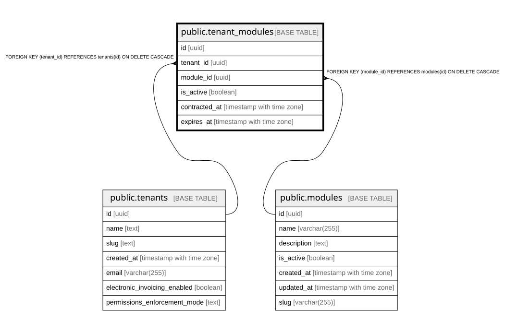

# public.tenant_modules

## Columns

| Name | Type | Default | Nullable | Children | Parents | Comment |
| ---- | ---- | ------- | -------- | -------- | ------- | ------- |
| id | uuid | gen_random_uuid() | false |  |  |  |
| tenant_id | uuid |  | false |  | [public.tenants](public.tenants.md) |  |
| module_id | uuid |  | false |  | [public.modules](public.modules.md) |  |
| is_active | boolean | true | true |  |  |  |
| contracted_at | timestamp with time zone |  | true |  |  |  |
| expires_at | timestamp with time zone |  | true |  |  |  |

## Constraints

| Name | Type | Definition |
| ---- | ---- | ---------- |
| tenant_modules_module_id_fkey | FOREIGN KEY | FOREIGN KEY (module_id) REFERENCES modules(id) ON DELETE CASCADE |
| tenant_modules_pkey | PRIMARY KEY | PRIMARY KEY (id) |
| tenant_modules_tenant_id_module_id_key | UNIQUE | UNIQUE (tenant_id, module_id) |
| tenant_modules_tenant_id_fkey | FOREIGN KEY | FOREIGN KEY (tenant_id) REFERENCES tenants(id) ON DELETE CASCADE |

## Indexes

| Name | Definition |
| ---- | ---------- |
| tenant_modules_pkey | CREATE UNIQUE INDEX tenant_modules_pkey ON public.tenant_modules USING btree (id) |
| tenant_modules_tenant_id_module_id_key | CREATE UNIQUE INDEX tenant_modules_tenant_id_module_id_key ON public.tenant_modules USING btree (tenant_id, module_id) |
| idx_tenant_modules_module | CREATE INDEX idx_tenant_modules_module ON public.tenant_modules USING btree (module_id) |
| idx_tenant_modules_tenant | CREATE INDEX idx_tenant_modules_tenant ON public.tenant_modules USING btree (tenant_id) |

## Relations

---

> Generated by [tbls](https://github.com/k1LoW/tbls)
