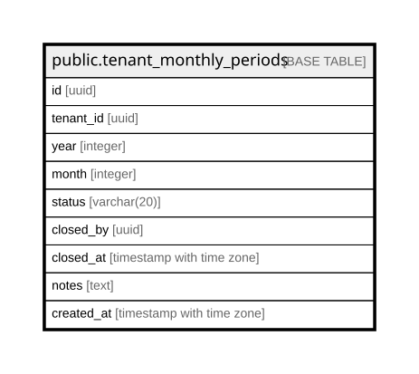

# public.tenant_monthly_periods

## Columns

| Name | Type | Default | Nullable | Children | Parents | Comment |
| ---- | ---- | ------- | -------- | -------- | ------- | ------- |
| id | uuid | gen_random_uuid() | false |  |  |  |
| tenant_id | uuid |  | false |  |  |  |
| year | integer |  | false |  |  |  |
| month | integer |  | false |  |  |  |
| status | varchar(20) | 'open'::character varying | false |  |  |  |
| closed_by | uuid |  | true |  |  |  |
| closed_at | timestamp with time zone |  | true |  |  |  |
| notes | text |  | true |  |  |  |
| created_at | timestamp with time zone | now() | false |  |  |  |

## Constraints

| Name | Type | Definition |
| ---- | ---- | ---------- |
| tenant_monthly_periods_month_check | CHECK | CHECK (((month >= 1) AND (month <= 12))) |
| tenant_monthly_periods_status_check | CHECK | CHECK (((status)::text = ANY ((ARRAY['open'::character varying, 'closed'::character varying])::text[]))) |
| tenant_monthly_periods_pkey | PRIMARY KEY | PRIMARY KEY (id) |
| uq_tenant_year_month | UNIQUE | UNIQUE (tenant_id, year, month) |

## Indexes

| Name | Definition |
| ---- | ---------- |
| tenant_monthly_periods_pkey | CREATE UNIQUE INDEX tenant_monthly_periods_pkey ON public.tenant_monthly_periods USING btree (id) |
| uq_tenant_year_month | CREATE UNIQUE INDEX uq_tenant_year_month ON public.tenant_monthly_periods USING btree (tenant_id, year, month) |
| idx_monthly_periods_tenant_status | CREATE INDEX idx_monthly_periods_tenant_status ON public.tenant_monthly_periods USING btree (tenant_id, status) |
| idx_monthly_periods_tenant_year_month | CREATE INDEX idx_monthly_periods_tenant_year_month ON public.tenant_monthly_periods USING btree (tenant_id, year, month) |

## Relations

---

> Generated by [tbls](https://github.com/k1LoW/tbls)
