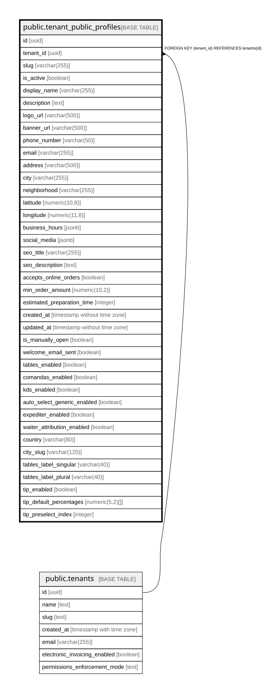

# public.tenant_public_profiles

## Description

Perfiles públicos de restaurantes para mostrar menú y información

## Columns

| Name | Type | Default | Nullable | Children | Parents | Comment |
| ---- | ---- | ------- | -------- | -------- | ------- | ------- |
| id | uuid | gen_random_uuid() | false |  |  |  |
| tenant_id | uuid |  | false |  | [public.tenants](public.tenants.md) |  |
| slug | varchar(255) |  | false |  |  | URL amigable única para acceder al perfil público |
| is_active | boolean | false | true |  |  | Controla si el perfil público está visible o no |
| display_name | varchar(255) |  | false |  |  |  |
| description | text |  | true |  |  |  |
| logo_url | varchar(500) |  | true |  |  |  |
| banner_url | varchar(500) |  | true |  |  |  |
| phone_number | varchar(50) |  | true |  |  |  |
| email | varchar(255) |  | true |  |  |  |
| address | varchar(500) |  | true |  |  |  |
| city | varchar(255) |  | true |  |  |  |
| neighborhood | varchar(255) |  | true |  |  |  |
| latitude | numeric(10,8) |  | true |  |  |  |
| longitude | numeric(11,8) |  | true |  |  |  |
| business_hours | jsonb |  | true |  |  | JSON con horarios de atención por día de la semana |
| social_media | jsonb |  | true |  |  | JSON con enlaces a redes sociales (Facebook, Instagram, WhatsApp) |
| seo_title | varchar(255) |  | true |  |  |  |
| seo_description | text |  | true |  |  |  |
| accepts_online_orders | boolean | false | true |  |  |  |
| min_order_amount | numeric(10,2) | 0 | true |  |  |  |
| estimated_preparation_time | integer | 30 | true |  |  |  |
| created_at | timestamp without time zone | CURRENT_TIMESTAMP | true |  |  |  |
| updated_at | timestamp without time zone | CURRENT_TIMESTAMP | true |  |  |  |
| is_manually_open | boolean | true | false |  |  |  |
| welcome_email_sent | boolean | false | false |  |  |  |
| tables_enabled | boolean | false | false |  |  |  |
| comandas_enabled | boolean | false | false |  |  |  |
| kds_enabled | boolean | false | false |  |  |  |
| auto_select_generic_enabled | boolean | false | false |  |  |  |
| expediter_enabled | boolean | false | false |  |  | POS expediter mode flag (issue #537). When true, the /pos UI surfaces a "Estado de comandas" button that opens a slide-over panel for waiters to advance comanda state (preparing → ready → delivered) without touching the KDS. Requires comandas_enabled=true. |
| waiter_attribution_enabled | boolean | false | false |  |  | Waiter attribution feature flag (warocol.com#573). When true, surfaces the "Mesero por mesa" admin panel + POS UX for assigning members to tables, sessions, and orders. Independent of tables_enabled — bar/counter modes (#575) work without tables. |
| country | varchar(80) | 'Colombia'::character varying | true |  |  | Country where the business operates (warocol.com#615). v1 locks the operator UI to Colombia; the column is plain VARCHAR so future countries can be added without a type change. |
| city_slug | varchar(120) |  | true |  |  | Normalized slug for the business city (warocol.com#615). References public_cities.city_slug; used as the routing key on warocol.com/{slug} and as the directory filter. The display name lives in the city column. |
| tables_label_singular | varchar(40) |  | true |  |  | Custom singular noun for "Mesa" (warocol.com#614). E.g. "Habitación" for hotels. NULL → frontend uses "Mesa". |
| tables_label_plural | varchar(40) |  | true |  |  | Custom plural noun for "Mesas" (warocol.com#614). E.g. "Habitaciones". NULL → frontend uses "Mesas". |
| tip_enabled | boolean | false | false |  |  | Master tipping toggle (warocol.com#635). When true, surfaces the tip selector at POS/online checkout and the /ventas/propinas history view. Default false preserves current behaviour. |
| tip_default_percentages | numeric(5,2)[] | ARRAY[(10)::numeric(5,2)] | false |  |  | Suggested tip presets shown as chips at checkout (warocol.com#635). Resolved on subtotal (pre-tax). App-level validation enforces max 5 entries, each between 0 and 100. |
| tip_preselect_index | integer |  | true |  |  | Index into tip_default_percentages to pre-select at checkout. NULL means nothing is pre-selected (recommended — Ley 1935/2018 voluntariness). |
| table_qr_module_enabled | boolean | false | false |  |  | Table QR ordering module (warocol.com#710). When true, tenant can enable per-table static QR links for diner self-order with staff confirmation. Default false preserves current behaviour. |
| tip_taxable_default | boolean | false | false |  |  | warocol.com#740 — default: include standard consumption tax on tips at checkout |
| timezone | text | 'America/Bogota'::text | false |  |  | IANA timezone for tenant operational dates, business hours, and report boundaries. Defaults to America/Bogota. |

## Constraints

| Name | Type | Definition |
| ---- | ---- | ---------- |
| tenant_public_profiles_tenant_id_fkey | FOREIGN KEY | FOREIGN KEY (tenant_id) REFERENCES tenants(id) |
| tenant_public_profiles_pkey | PRIMARY KEY | PRIMARY KEY (id) |
| tenant_public_profiles_tenant_id_key | UNIQUE | UNIQUE (tenant_id) |
| tenant_public_profiles_slug_key | UNIQUE | UNIQUE (slug) |
| tenant_public_profiles_timezone_non_blank | CHECK | CHECK (btrim(timezone) <> '') |

## Indexes

| Name | Definition |
| ---- | ---------- |
| tenant_public_profiles_pkey | CREATE UNIQUE INDEX tenant_public_profiles_pkey ON public.tenant_public_profiles USING btree (id) |
| tenant_public_profiles_tenant_id_key | CREATE UNIQUE INDEX tenant_public_profiles_tenant_id_key ON public.tenant_public_profiles USING btree (tenant_id) |
| tenant_public_profiles_slug_key | CREATE UNIQUE INDEX tenant_public_profiles_slug_key ON public.tenant_public_profiles USING btree (slug) |
| idx_tenant_profiles_slug | CREATE INDEX idx_tenant_profiles_slug ON public.tenant_public_profiles USING btree (slug) |
| idx_tenant_profiles_tenant | CREATE INDEX idx_tenant_profiles_tenant ON public.tenant_public_profiles USING btree (tenant_id) |
| idx_tenant_profiles_active | CREATE INDEX idx_tenant_profiles_active ON public.tenant_public_profiles USING btree (is_active) |
| idx_tpp_city_slug_active | CREATE INDEX idx_tpp_city_slug_active ON public.tenant_public_profiles USING btree (city_slug) WHERE (is_active = true) |

## Relations

---

> Generated by [tbls](https://github.com/k1LoW/tbls)
