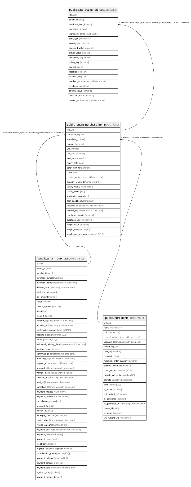

# public.tenant_purchase_items

## Description

Items individuales de cada compra - fuente de costos reales

## Columns

| Name | Type | Default | Nullable | Children | Parents | Comment |
| ---- | ---- | ------- | -------- | -------- | ------- | ------- |
| id | uuid | gen_random_uuid() | false | [public.data_quality_alerts](public.data_quality_alerts.md) |  |  |
| purchase_id | uuid |  | false |  | [public.tenant_purchases](public.tenant_purchases.md) |  |
| ingredient_id | uuid |  | false |  | [public.ingredients](public.ingredients.md) |  |
| quantity | numeric |  | false |  |  |  |
| unit | varchar |  | false |  |  |  |
| unit_cost | numeric |  | true |  |  |  |
| total_cost | numeric |  | true |  |  | Calculado como quantity * unit_cost |
| expiry_date | date |  | true |  |  |  |
| batch_number | varchar |  | true |  |  |  |
| notes | text |  | true |  |  |  |
| created_at | timestamp with time zone | now() | true |  |  |  |
| quantity_received | numeric(15,3) |  | true |  |  | Actual quantity received (may differ from ordered quantity) |
| quality_status | varchar(50) |  | true |  |  | Quality assessment: good, acceptable, poor, rejected |
| quality_notes | text |  | true |  |  |  |
| verification_notes | text |  | true |  |  |  |
| item_condition | varchar(50) |  | true |  |  | Condition: complete, partial, missing, damaged |
| received_at | timestamp with time zone |  | true |  |  |  |
| verified_at | timestamp with time zone |  | true |  |  |  |
| purchase_quantity | numeric |  | true |  |  |  |
| purchase_unit | varchar(50) |  | true |  |  |  |
| weight_value | numeric |  | true |  |  |  |
| weight_unit | varchar(10) |  | true |  |  |  |
| weight_per_unit_grams | numeric(10,2) |  | true |  |  |  |

## Constraints

| Name | Type | Definition |
| ---- | ---- | ---------- |
| chk_item_condition | CHECK | CHECK (((item_condition IS NULL) OR ((item_condition)::text = ANY (ARRAY[('complete'::character varying)::text, ('partial'::character varying)::text, ('missing'::character varying)::text, ('damaged'::character varying)::text])))) |
| chk_quality_status | CHECK | CHECK (((quality_status IS NULL) OR ((quality_status)::text = ANY (ARRAY[('good'::character varying)::text, ('acceptable'::character varying)::text, ('poor'::character varying)::text, ('rejected'::character varying)::text])))) |
| chk_quantity_received_positive | CHECK | CHECK (((quantity_received IS NULL) OR (quantity_received >= (0)::numeric))) |
| tenant_purchase_items_quantity_check | CHECK | CHECK ((quantity > (0)::numeric)) |
| tenant_purchase_items_unit_cost_check | CHECK | CHECK ((unit_cost >= (0)::numeric)) |
| tenant_purchase_items_ingredient_id_fkey | FOREIGN KEY | FOREIGN KEY (ingredient_id) REFERENCES ingredients(id) |
| tenant_purchase_items_pkey | PRIMARY KEY | PRIMARY KEY (id) |
| tenant_purchase_items_purchase_id_fkey | FOREIGN KEY | FOREIGN KEY (purchase_id) REFERENCES tenant_purchases(id) ON DELETE CASCADE |

## Indexes

| Name | Definition |
| ---- | ---------- |
| tenant_purchase_items_pkey | CREATE UNIQUE INDEX tenant_purchase_items_pkey ON public.tenant_purchase_items USING btree (id) |
| idx_purchase_items_quality | CREATE INDEX idx_purchase_items_quality ON public.tenant_purchase_items USING btree (quality_status) WHERE (quality_status IS NOT NULL) |
| idx_purchase_items_received | CREATE INDEX idx_purchase_items_received ON public.tenant_purchase_items USING btree (quantity_received) WHERE (quantity_received IS NOT NULL) |
| idx_tenant_purchase_items_ingredient_id | CREATE INDEX idx_tenant_purchase_items_ingredient_id ON public.tenant_purchase_items USING btree (ingredient_id) |
| idx_tenant_purchase_items_purchase_id | CREATE INDEX idx_tenant_purchase_items_purchase_id ON public.tenant_purchase_items USING btree (purchase_id) |

## Relations

---

> Generated by [tbls](https://github.com/k1LoW/tbls)
