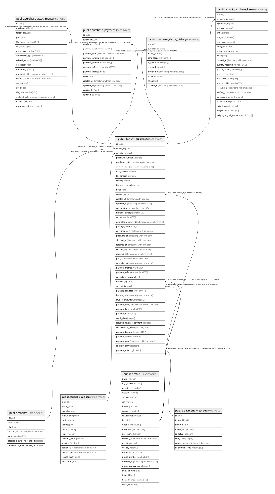

# public.tenant_purchases

## Description

Compras de ingredientes - crea trazabilidad de costos reales

## Columns

| Name | Type | Default | Nullable | Children | Parents | Comment |
| ---- | ---- | ------- | -------- | -------- | ------- | ------- |
| id | uuid | gen_random_uuid() | false | [public.purchase_attachments](public.purchase_attachments.md) [public.purchase_payments](public.purchase_payments.md) [public.purchase_status_history](public.purchase_status_history.md) [public.tenant_purchase_items](public.tenant_purchase_items.md) |  |  |
| tenant_id | uuid |  | false |  | [public.tenants](public.tenants.md) |  |
| supplier_id | uuid |  | true |  | [public.tenant_suppliers](public.tenant_suppliers.md) |  |
| purchase_number | varchar |  | true |  |  |  |
| purchase_date | timestamp with time zone | now() | true |  |  |  |
| delivery_date | timestamp with time zone |  | true |  |  |  |
| total_amount | numeric | 0 | true |  |  |  |
| tax_amount | numeric | 0 | true |  |  |  |
| status | varchar | 'pending'::character varying | true |  |  | pending: pendiente, confirmed: confirmada, received: recibida, cancelled: cancelada |
| invoice_number | varchar |  | true |  |  |  |
| notes | text |  | true |  |  |  |
| created_by | uuid |  | true |  | [public.profile](public.profile.md) |  |
| created_at | timestamp with time zone | now() | true |  |  |  |
| updated_at | timestamp with time zone | now() | true |  |  |  |
| confirmation_number | varchar(100) |  | true |  |  | Supplier confirmation number |
| tracking_number | varchar(100) |  | true |  |  | Shipping tracking/guide number |
| carrier | varchar(100) |  | true |  |  | Shipping carrier/company name |
| estimated_delivery_date | timestamp with time zone |  | true |  |  |  |
| package_count | integer |  | true |  |  |  |
| confirmed_at | timestamp with time zone |  | true |  |  |  |
| preparing_at | timestamp with time zone |  | true |  |  |  |
| shipped_at | timestamp with time zone |  | true |  |  |  |
| received_at | timestamp with time zone |  | true |  |  |  |
| verified_at | timestamp with time zone |  | true |  |  |  |
| invoiced_at | timestamp with time zone |  | true |  |  |  |
| paid_at | timestamp with time zone |  | true |  |  |  |
| cancelled_at | timestamp with time zone |  | true |  |  |  |
| payment_method | varchar(50) |  | true |  |  |  |
| payment_reference | varchar(100) |  | true |  |  |  |
| cancellation_reason | text |  | true |  |  |  |
| received_by | uuid |  | true |  | [public.profile](public.profile.md) |  |
| verified_by | uuid |  | true |  | [public.profile](public.profile.md) |  |
| package_condition | varchar(50) |  | true |  |  |  |
| invoice_date | timestamp with time zone |  | true |  |  | Date on the supplier invoice or remision document |
| invoice_amount | numeric(10,2) |  | true |  |  | Actual invoiced amount (may differ from initial total_amount) |
| payment_due_date | timestamp with time zone |  | true |  |  | Payment due date (for factura_credito, calculated as invoice_date + credit_days) |
| payment_type | varchar(50) |  | true |  |  | Tipo de pago: contado, credito, contraentrega, credito_consolidado |
| payment_terms | text |  | true |  |  | Términos de pago en texto (ej: 30 días neto, 2/10 neto 30) |
| credit_days | integer |  | true |  |  | Número de días de crédito (solo para credito y credito_consolidado) |
| requires_advance_payment | boolean | false | true |  |  | Indica si requiere pago anticipado (para contraentrega) |
| consolidation_group | varchar(100) |  | true |  |  | Grupo para consolidar remisiones en factura mensual |
| payment_balance | numeric(10,2) | 0 | true |  |  | Balance pendiente de pago (para pagos parciales) |
| payment_amount | numeric |  | true |  |  |  |
| payment_date | timestamp with time zone |  | true |  |  |  |
| is_direct_entry | boolean | false | true |  |  |  |
| payment_method_id | uuid |  | true |  | [public.payment_methods](public.payment_methods.md) |  |

## Constraints

| Name | Type | Definition |
| ---- | ---- | ---------- |
| chk_package_condition | CHECK | CHECK (((package_condition IS NULL) OR ((package_condition)::text = ANY (ARRAY[('good'::character varying)::text, ('damaged'::character varying)::text, ('partial'::character varying)::text])))) |
| tenant_purchases_status_check | CHECK | CHECK (((status)::text = ANY (ARRAY[('quotation'::character varying)::text, ('pending'::character varying)::text, ('confirmed'::character varying)::text, ('preparing'::character varying)::text, ('shipped'::character varying)::text, ('partially_received'::character varying)::text, ('received'::character varying)::text, ('verified'::character varying)::text, ('invoiced'::character varying)::text, ('paid'::character varying)::text, ('cancelled'::character varying)::text, ('overdue'::character varying)::text]))) |
| fk_purchase_received_by | FOREIGN KEY | FOREIGN KEY (received_by) REFERENCES profile(id) ON DELETE SET NULL |
| fk_purchase_verified_by | FOREIGN KEY | FOREIGN KEY (verified_by) REFERENCES profile(id) ON DELETE SET NULL |
| tenant_purchases_created_by_fkey | FOREIGN KEY | FOREIGN KEY (created_by) REFERENCES profile(id) |
| tenant_purchases_pkey | PRIMARY KEY | PRIMARY KEY (id) |
| tenant_purchases_supplier_id_fkey | FOREIGN KEY | FOREIGN KEY (supplier_id) REFERENCES tenant_suppliers(id) |
| tenant_purchases_tenant_id_fkey | FOREIGN KEY | FOREIGN KEY (tenant_id) REFERENCES tenants(id) |
| tenant_purchases_payment_method_id_fkey | FOREIGN KEY | FOREIGN KEY (payment_method_id) REFERENCES payment_methods(id) ON DELETE SET NULL |

## Indexes

| Name | Definition |
| ---- | ---------- |
| tenant_purchases_pkey | CREATE UNIQUE INDEX tenant_purchases_pkey ON public.tenant_purchases USING btree (id) |
| idx_purchases_confirmation_number | CREATE INDEX idx_purchases_confirmation_number ON public.tenant_purchases USING btree (confirmation_number) WHERE (confirmation_number IS NOT NULL) |
| idx_purchases_confirmed_at | CREATE INDEX idx_purchases_confirmed_at ON public.tenant_purchases USING btree (confirmed_at) WHERE (confirmed_at IS NOT NULL) |
| idx_purchases_received_at | CREATE INDEX idx_purchases_received_at ON public.tenant_purchases USING btree (received_at) WHERE (received_at IS NOT NULL) |
| idx_purchases_shipped_at | CREATE INDEX idx_purchases_shipped_at ON public.tenant_purchases USING btree (shipped_at) WHERE (shipped_at IS NOT NULL) |
| idx_purchases_tracking_number | CREATE INDEX idx_purchases_tracking_number ON public.tenant_purchases USING btree (tracking_number) WHERE (tracking_number IS NOT NULL) |
| idx_tenant_purchases_date | CREATE INDEX idx_tenant_purchases_date ON public.tenant_purchases USING btree (purchase_date) |
| idx_tenant_purchases_invoice_date | CREATE INDEX idx_tenant_purchases_invoice_date ON public.tenant_purchases USING btree (invoice_date) WHERE (invoice_date IS NOT NULL) |
| idx_tenant_purchases_payment_due_date | CREATE INDEX idx_tenant_purchases_payment_due_date ON public.tenant_purchases USING btree (payment_due_date) WHERE (payment_due_date IS NOT NULL) |
| idx_tenant_purchases_supplier_id | CREATE INDEX idx_tenant_purchases_supplier_id ON public.tenant_purchases USING btree (supplier_id) |
| idx_tenant_purchases_tenant_id | CREATE INDEX idx_tenant_purchases_tenant_id ON public.tenant_purchases USING btree (tenant_id) |
| idx_tenant_purchases_direct_entry | CREATE INDEX idx_tenant_purchases_direct_entry ON public.tenant_purchases USING btree (tenant_id, is_direct_entry) WHERE (is_direct_entry = true) |

## Relations

---

> Generated by [tbls](https://github.com/k1LoW/tbls)
