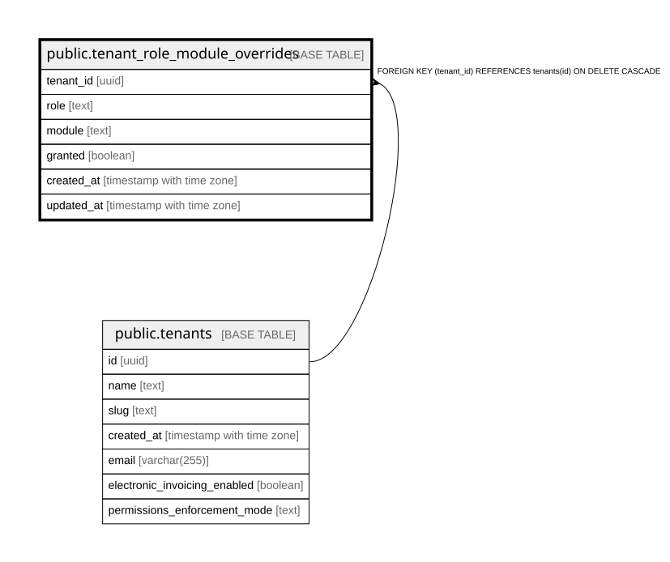

# public.tenant_role_module_overrides

## Description

Per-tenant deltas on top of DEFAULT_ROLE_MODULES (app/core/permissions.py). Empty rows => defaults apply. granted=true adds, granted=false removes. Merge happens in the Python resolver.

## Columns

| Name | Type | Default | Nullable | Children | Parents | Comment |
| ---- | ---- | ------- | -------- | -------- | ------- | ------- |
| tenant_id | uuid |  | false |  | [public.tenants](public.tenants.md) |  |
| role | text |  | false |  |  |  |
| module | text |  | false |  |  |  |
| granted | boolean |  | false |  |  |  |
| created_at | timestamp with time zone | now() | false |  |  |  |
| updated_at | timestamp with time zone | now() | false |  |  |  |

## Constraints

| Name | Type | Definition |
| ---- | ---- | ---------- |
| tenant_role_module_overrides_tenant_id_fkey | FOREIGN KEY | FOREIGN KEY (tenant_id) REFERENCES tenants(id) ON DELETE CASCADE |
| tenant_role_module_overrides_pkey | PRIMARY KEY | PRIMARY KEY (tenant_id, role, module) |

## Indexes

| Name | Definition |
| ---- | ---------- |
| tenant_role_module_overrides_pkey | CREATE UNIQUE INDEX tenant_role_module_overrides_pkey ON public.tenant_role_module_overrides USING btree (tenant_id, role, module) |
| idx_tenant_role_module_overrides_tenant | CREATE INDEX idx_tenant_role_module_overrides_tenant ON public.tenant_role_module_overrides USING btree (tenant_id) |

## Relations

---

> Generated by [tbls](https://github.com/k1LoW/tbls)
