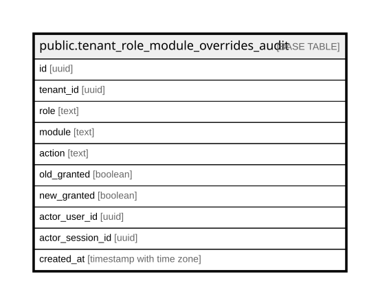

# public.tenant_role_module_overrides_audit

## Description

Append-only history of changes to tenant_role_module_overrides. Written application-side from the admin endpoint that mutates the override table (Epic 4 / #E4.x).

## Columns

| Name | Type | Default | Nullable | Children | Parents | Comment |
| ---- | ---- | ------- | -------- | -------- | ------- | ------- |
| id | uuid | gen_random_uuid() | false |  |  |  |
| tenant_id | uuid |  | false |  |  |  |
| role | text |  | false |  |  |  |
| module | text |  | false |  |  |  |
| action | text |  | false |  |  |  |
| old_granted | boolean |  | true |  |  |  |
| new_granted | boolean |  | true |  |  |  |
| actor_user_id | uuid |  | true |  |  |  |
| actor_session_id | uuid |  | true |  |  |  |
| created_at | timestamp with time zone | now() | false |  |  |  |

## Constraints

| Name | Type | Definition |
| ---- | ---- | ---------- |
| tenant_role_module_overrides_audit_action_check | CHECK | CHECK ((action = ANY (ARRAY['insert'::text, 'update'::text, 'delete'::text]))) |
| tenant_role_module_overrides_audit_pkey | PRIMARY KEY | PRIMARY KEY (id) |

## Indexes

| Name | Definition |
| ---- | ---------- |
| tenant_role_module_overrides_audit_pkey | CREATE UNIQUE INDEX tenant_role_module_overrides_audit_pkey ON public.tenant_role_module_overrides_audit USING btree (id) |
| idx_tenant_role_module_overrides_audit_tenant_created | CREATE INDEX idx_tenant_role_module_overrides_audit_tenant_created ON public.tenant_role_module_overrides_audit USING btree (tenant_id, created_at DESC) |

## Relations

---

> Generated by [tbls](https://github.com/k1LoW/tbls)
