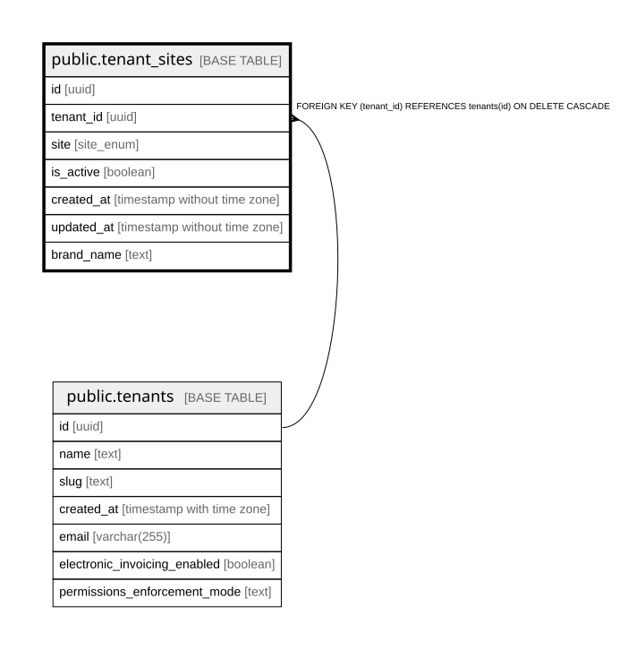

# public.tenant_sites

## Columns

| Name | Type | Default | Nullable | Children | Parents | Comment |
| ---- | ---- | ------- | -------- | -------- | ------- | ------- |
| id | uuid | gen_random_uuid() | false |  |  |  |
| tenant_id | uuid |  | false |  | [public.tenants](public.tenants.md) |  |
| site | site_enum |  | false |  |  |  |
| is_active | boolean | true | true |  |  |  |
| created_at | timestamp without time zone | now() | true |  |  |  |
| updated_at | timestamp without time zone | now() | true |  |  |  |
| brand_name | text |  | true |  |  |  |

## Constraints

| Name | Type | Definition |
| ---- | ---- | ---------- |
| tenant_sites_pkey | PRIMARY KEY | PRIMARY KEY (id) |
| tenant_sites_tenant_id_fkey | FOREIGN KEY | FOREIGN KEY (tenant_id) REFERENCES tenants(id) ON DELETE CASCADE |
| unique_tenant_site | UNIQUE | UNIQUE (tenant_id, site) |

## Indexes

| Name | Definition |
| ---- | ---------- |
| tenant_sites_pkey | CREATE UNIQUE INDEX tenant_sites_pkey ON public.tenant_sites USING btree (id) |
| unique_tenant_site | CREATE UNIQUE INDEX unique_tenant_site ON public.tenant_sites USING btree (tenant_id, site) |
| idx_tenant_sites_site | CREATE INDEX idx_tenant_sites_site ON public.tenant_sites USING btree (site) |
| idx_tenant_sites_tenant | CREATE INDEX idx_tenant_sites_tenant ON public.tenant_sites USING btree (tenant_id) |

## Triggers

| Name | Definition |
| ---- | ---------- |
| update_tenant_sites_updated_at | CREATE TRIGGER update_tenant_sites_updated_at BEFORE UPDATE ON public.tenant_sites FOR EACH ROW EXECUTE FUNCTION update_updated_at_column() |

## Relations

---

> Generated by [tbls](https://github.com/k1LoW/tbls)
