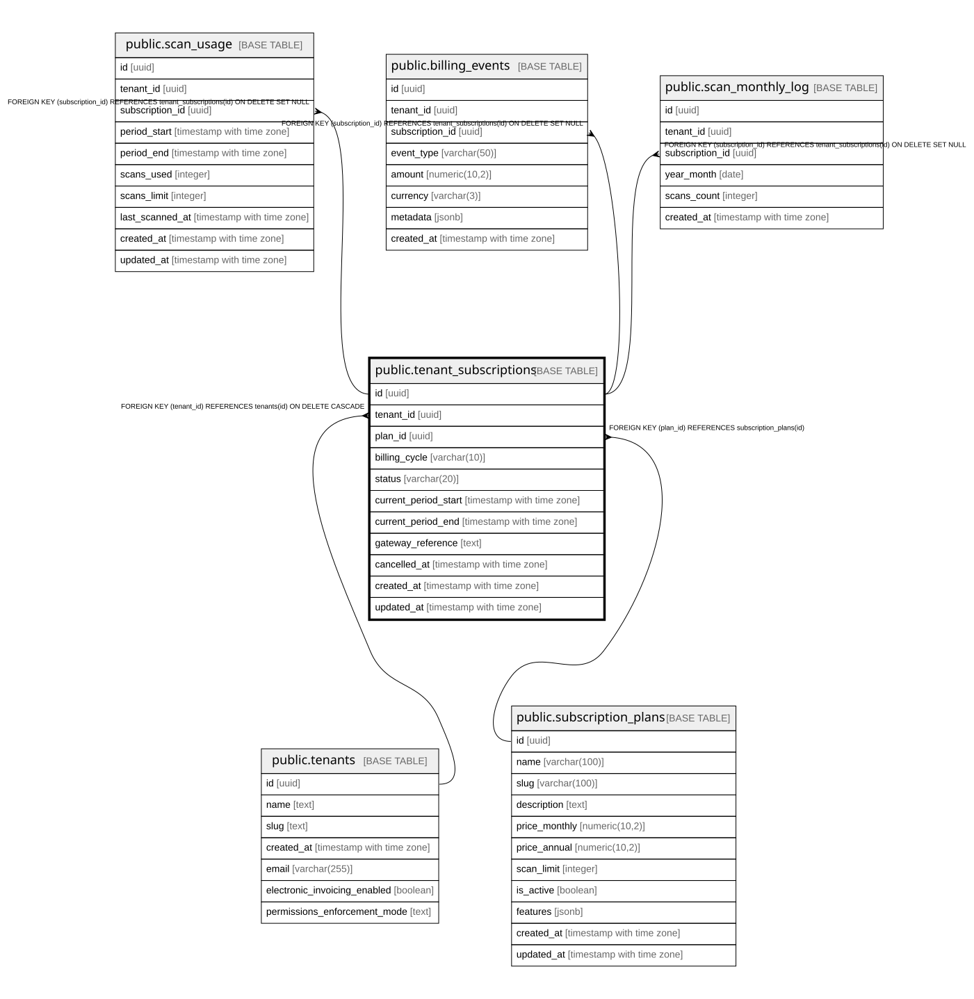

# public.tenant_subscriptions

## Columns

| Name | Type | Default | Nullable | Children | Parents | Comment |
| ---- | ---- | ------- | -------- | -------- | ------- | ------- |
| id | uuid | gen_random_uuid() | false | [public.scan_usage](public.scan_usage.md) [public.billing_events](public.billing_events.md) [public.scan_monthly_log](public.scan_monthly_log.md) |  |  |
| tenant_id | uuid |  | false |  | [public.tenants](public.tenants.md) |  |
| plan_id | uuid |  | false |  | [public.subscription_plans](public.subscription_plans.md) |  |
| billing_cycle | varchar(10) |  | false |  |  |  |
| status | varchar(20) | 'pending'::character varying | true |  |  |  |
| current_period_start | timestamp with time zone |  | false |  |  |  |
| current_period_end | timestamp with time zone |  | false |  |  |  |
| gateway_reference | text |  | true |  |  |  |
| cancelled_at | timestamp with time zone |  | true |  |  |  |
| created_at | timestamp with time zone | now() | true |  |  |  |
| updated_at | timestamp with time zone | now() | true |  |  |  |

## Constraints

| Name | Type | Definition |
| ---- | ---- | ---------- |
| tenant_subscriptions_billing_cycle_check | CHECK | CHECK (((billing_cycle)::text = ANY ((ARRAY['monthly'::character varying, 'annual'::character varying])::text[]))) |
| tenant_subscriptions_status_check | CHECK | CHECK (((status)::text = ANY ((ARRAY['pending'::character varying, 'active'::character varying, 'past_due'::character varying, 'cancelled'::character varying, 'expired'::character varying])::text[]))) |
| tenant_subscriptions_tenant_id_fkey | FOREIGN KEY | FOREIGN KEY (tenant_id) REFERENCES tenants(id) ON DELETE CASCADE |
| tenant_subscriptions_plan_id_fkey | FOREIGN KEY | FOREIGN KEY (plan_id) REFERENCES subscription_plans(id) |
| tenant_subscriptions_pkey | PRIMARY KEY | PRIMARY KEY (id) |
| tenant_subscriptions_tenant_id_key | UNIQUE | UNIQUE (tenant_id) |

## Indexes

| Name | Definition |
| ---- | ---------- |
| tenant_subscriptions_pkey | CREATE UNIQUE INDEX tenant_subscriptions_pkey ON public.tenant_subscriptions USING btree (id) |
| tenant_subscriptions_tenant_id_key | CREATE UNIQUE INDEX tenant_subscriptions_tenant_id_key ON public.tenant_subscriptions USING btree (tenant_id) |
| idx_tenant_subscriptions_tenant | CREATE INDEX idx_tenant_subscriptions_tenant ON public.tenant_subscriptions USING btree (tenant_id) |
| idx_tenant_subscriptions_status | CREATE INDEX idx_tenant_subscriptions_status ON public.tenant_subscriptions USING btree (status, plan_id) |
| idx_tenant_subscriptions_period | CREATE INDEX idx_tenant_subscriptions_period ON public.tenant_subscriptions USING btree (current_period_end) |

## Relations

---

> Generated by [tbls](https://github.com/k1LoW/tbls)
