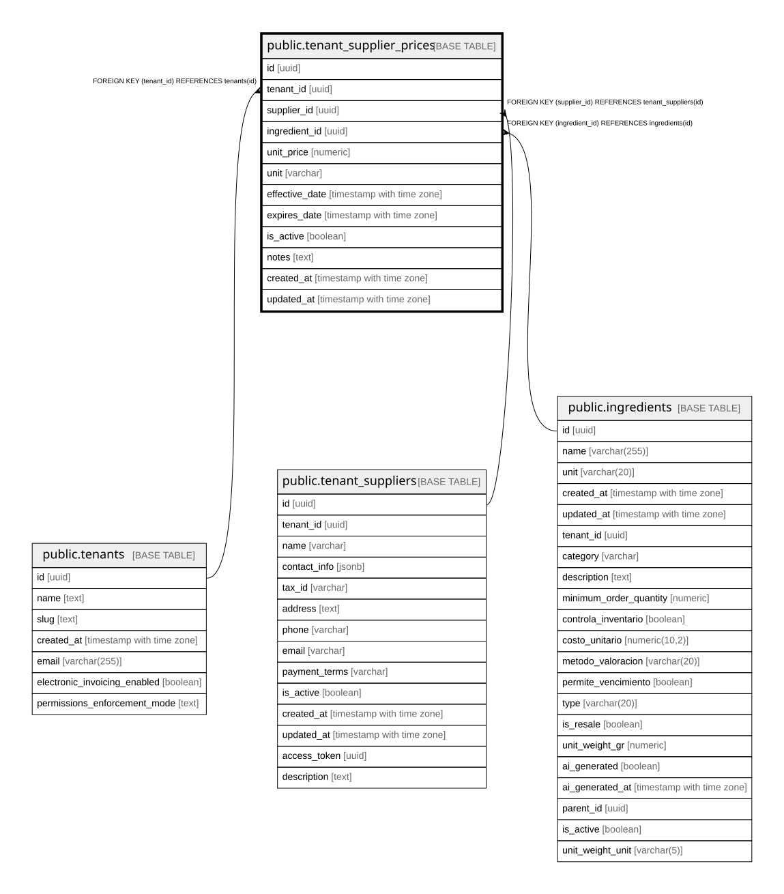

# public.tenant_supplier_prices

## Description

Precios de referencia actuales por proveedor e ingrediente

## Columns

| Name | Type | Default | Nullable | Children | Parents | Comment |
| ---- | ---- | ------- | -------- | -------- | ------- | ------- |
| id | uuid | gen_random_uuid() | false |  |  |  |
| tenant_id | uuid |  | false |  | [public.tenants](public.tenants.md) |  |
| supplier_id | uuid |  | false |  | [public.tenant_suppliers](public.tenant_suppliers.md) |  |
| ingredient_id | uuid |  | false |  | [public.ingredients](public.ingredients.md) |  |
| unit_price | numeric |  | false |  |  | Precio por unidad de medida (COP/gr, COP/ml, COP/und) |
| unit | varchar |  | false |  |  |  |
| effective_date | timestamp with time zone | now() | true |  |  | Fecha desde cuando es válido este precio |
| expires_date | timestamp with time zone |  | true |  |  | Fecha hasta cuando es válido (NULL = indefinido) |
| is_active | boolean | true | true |  |  | Solo un precio activo por proveedor-ingrediente |
| notes | text |  | true |  |  |  |
| created_at | timestamp with time zone | now() | true |  |  |  |
| updated_at | timestamp with time zone | now() | true |  |  |  |

## Constraints

| Name | Type | Definition |
| ---- | ---- | ---------- |
| tenant_supplier_prices_unit_price_check | CHECK | CHECK ((unit_price >= (0)::numeric)) |
| tenant_supplier_prices_ingredient_id_fkey | FOREIGN KEY | FOREIGN KEY (ingredient_id) REFERENCES ingredients(id) |
| tenant_supplier_prices_pkey | PRIMARY KEY | PRIMARY KEY (id) |
| tenant_supplier_prices_supplier_id_fkey | FOREIGN KEY | FOREIGN KEY (supplier_id) REFERENCES tenant_suppliers(id) |
| tenant_supplier_prices_tenant_id_fkey | FOREIGN KEY | FOREIGN KEY (tenant_id) REFERENCES tenants(id) |
| unique_active_supplier_ingredient | x | EXCLUDE USING btree (tenant_id WITH =, supplier_id WITH =, ingredient_id WITH =) WHERE ((is_active = true)) |

## Indexes

| Name | Definition |
| ---- | ---------- |
| tenant_supplier_prices_pkey | CREATE UNIQUE INDEX tenant_supplier_prices_pkey ON public.tenant_supplier_prices USING btree (id) |
| unique_active_supplier_ingredient | CREATE INDEX unique_active_supplier_ingredient ON public.tenant_supplier_prices USING btree (tenant_id, supplier_id, ingredient_id) WHERE (is_active = true) |
| idx_tenant_supplier_prices_active | CREATE INDEX idx_tenant_supplier_prices_active ON public.tenant_supplier_prices USING btree (tenant_id, is_active) |
| idx_tenant_supplier_prices_effective | CREATE INDEX idx_tenant_supplier_prices_effective ON public.tenant_supplier_prices USING btree (effective_date) |
| idx_tenant_supplier_prices_ingredient | CREATE INDEX idx_tenant_supplier_prices_ingredient ON public.tenant_supplier_prices USING btree (ingredient_id) |
| idx_tenant_supplier_prices_supplier | CREATE INDEX idx_tenant_supplier_prices_supplier ON public.tenant_supplier_prices USING btree (supplier_id) |
| idx_tenant_supplier_prices_tenant | CREATE INDEX idx_tenant_supplier_prices_tenant ON public.tenant_supplier_prices USING btree (tenant_id) |

## Relations

---

> Generated by [tbls](https://github.com/k1LoW/tbls)
