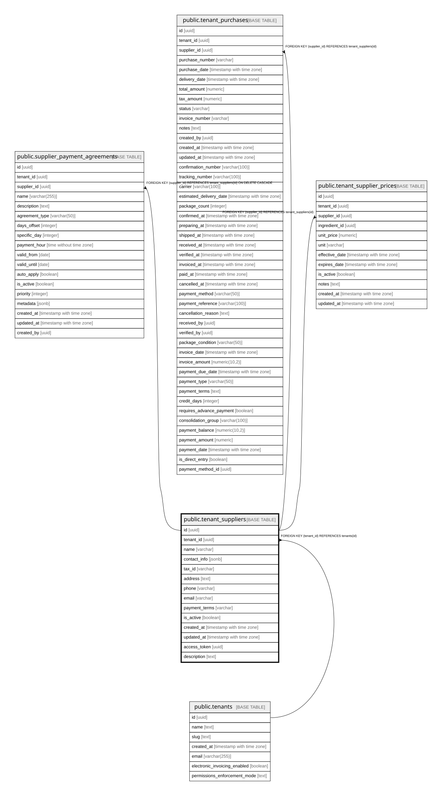

# public.tenant_suppliers

## Description

Proveedores por tenant - reemplaza el campo supplier en ingredients

## Columns

| Name | Type | Default | Nullable | Children | Parents | Comment |
| ---- | ---- | ------- | -------- | -------- | ------- | ------- |
| id | uuid | gen_random_uuid() | false | [public.supplier_payment_agreements](public.supplier_payment_agreements.md) [public.tenant_purchases](public.tenant_purchases.md) [public.tenant_supplier_prices](public.tenant_supplier_prices.md) |  |  |
| tenant_id | uuid |  | false |  | [public.tenants](public.tenants.md) |  |
| name | varchar |  | false |  |  |  |
| contact_info | jsonb |  | true |  |  |  |
| tax_id | varchar |  | true |  |  |  |
| address | text |  | true |  |  |  |
| phone | varchar |  | true |  |  |  |
| email | varchar |  | true |  |  |  |
| payment_terms | varchar |  | true |  |  |  |
| is_active | boolean | true | true |  |  |  |
| created_at | timestamp with time zone | now() | true |  |  |  |
| updated_at | timestamp with time zone | now() | true |  |  |  |
| access_token | uuid | gen_random_uuid() | true |  |  |  |
| description | text |  | true |  |  |  |

## Constraints

| Name | Type | Definition |
| ---- | ---- | ---------- |
| tenant_suppliers_access_token_key | UNIQUE | UNIQUE (access_token) |
| tenant_suppliers_pkey | PRIMARY KEY | PRIMARY KEY (id) |
| tenant_suppliers_tenant_id_fkey | FOREIGN KEY | FOREIGN KEY (tenant_id) REFERENCES tenants(id) |

## Indexes

| Name | Definition |
| ---- | ---------- |
| tenant_suppliers_access_token_key | CREATE UNIQUE INDEX tenant_suppliers_access_token_key ON public.tenant_suppliers USING btree (access_token) |
| tenant_suppliers_pkey | CREATE UNIQUE INDEX tenant_suppliers_pkey ON public.tenant_suppliers USING btree (id) |
| idx_tenant_suppliers_access_token | CREATE INDEX idx_tenant_suppliers_access_token ON public.tenant_suppliers USING btree (access_token) |
| idx_tenant_suppliers_tenant_id | CREATE INDEX idx_tenant_suppliers_tenant_id ON public.tenant_suppliers USING btree (tenant_id) |

## Relations

---

> Generated by [tbls](https://github.com/k1LoW/tbls)
