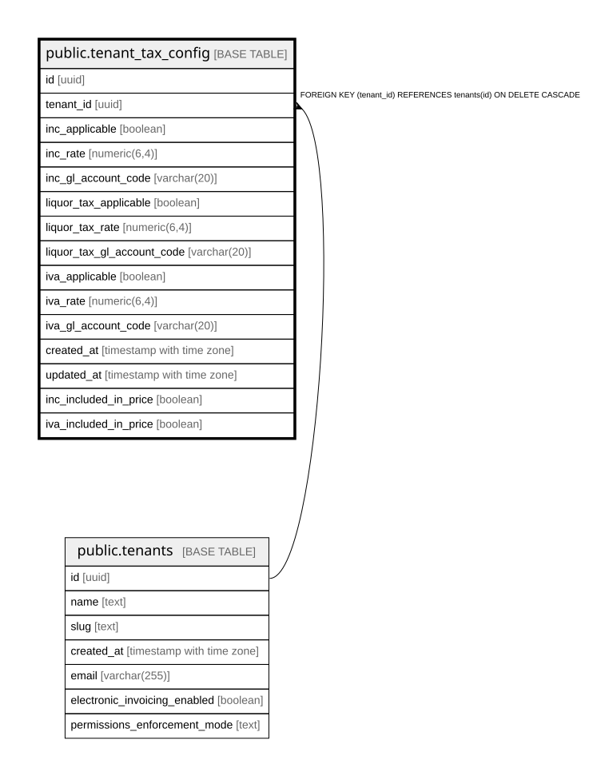

# public.tenant_tax_config

## Columns

| Name | Type | Default | Nullable | Children | Parents | Comment |
| ---- | ---- | ------- | -------- | -------- | ------- | ------- |
| id | uuid | gen_random_uuid() | false |  |  |  |
| tenant_id | uuid |  | false |  | [public.tenants](public.tenants.md) |  |
| inc_applicable | boolean | false | false |  |  |  |
| inc_rate | numeric(6,4) | 0.0800 | false |  |  |  |
| inc_gl_account_code | varchar(20) | '2495'::character varying | false |  |  |  |
| liquor_tax_applicable | boolean | false | false |  |  |  |
| liquor_tax_rate | numeric(6,4) | 0.0000 | false |  |  |  |
| liquor_tax_gl_account_code | varchar(20) | '2408'::character varying | false |  |  |  |
| iva_applicable | boolean | false | false |  |  |  |
| iva_rate | numeric(6,4) | 0.1900 | false |  |  |  |
| iva_gl_account_code | varchar(20) | '2408'::character varying | false |  |  |  |
| created_at | timestamp with time zone | now() | false |  |  |  |
| updated_at | timestamp with time zone | now() | false |  |  |  |
| inc_included_in_price | boolean | true | false |  |  |  |
| iva_included_in_price | boolean | false | false |  |  |  |

## Constraints

| Name | Type | Definition |
| ---- | ---- | ---------- |
| tenant_tax_config_tenant_id_fkey | FOREIGN KEY | FOREIGN KEY (tenant_id) REFERENCES tenants(id) ON DELETE CASCADE |
| tenant_tax_config_pkey | PRIMARY KEY | PRIMARY KEY (id) |
| tenant_tax_config_tenant_id_key | UNIQUE | UNIQUE (tenant_id) |

## Indexes

| Name | Definition |
| ---- | ---------- |
| tenant_tax_config_pkey | CREATE UNIQUE INDEX tenant_tax_config_pkey ON public.tenant_tax_config USING btree (id) |
| tenant_tax_config_tenant_id_key | CREATE UNIQUE INDEX tenant_tax_config_tenant_id_key ON public.tenant_tax_config USING btree (tenant_id) |

## Relations

---

> Generated by [tbls](https://github.com/k1LoW/tbls)
