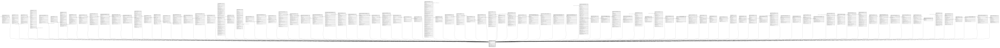

# public.tenants

## Columns

| Name | Type | Default | Nullable | Children | Parents | Comment |
| ---- | ---- | ------- | -------- | -------- | ------- | ------- |
| id | uuid |  | false | [public.achievements](public.achievements.md) [public.sessions](public.sessions.md) [public.api_tokens](public.api_tokens.md) [public.articles](public.articles.md) [public.base_recipe_templates](public.base_recipe_templates.md) [public.categories](public.categories.md) [public.clusters](public.clusters.md) [public.daily_metrics](public.daily_metrics.md) [public.evaluation_criteria](public.evaluation_criteria.md) [public.evaluation_results](public.evaluation_results.md) [public.gamification_activities](public.gamification_activities.md) [public.gamification_config](public.gamification_config.md) [public.gamification_modules](public.gamification_modules.md) [public.ingredients](public.ingredients.md) [public.leaderboards](public.leaderboards.md) [public.legal_info](public.legal_info.md) [public.magic_tokens](public.magic_tokens.md) [public.marketplace_items](public.marketplace_items.md) [public.marketplace_purchases](public.marketplace_purchases.md) [public.modifier_change_history](public.modifier_change_history.md) [public.modifier_groups](public.modifier_groups.md) [public.orders](public.orders.md) [public.pos_carts](public.pos_carts.md) [public.product](public.product.md) [public.product_base_types](public.product_base_types.md) [public.product_change_history](public.product_change_history.md) [public.product_recipes](public.product_recipes.md) [public.purchase_attachments](public.purchase_attachments.md) [public.purchase_payments](public.purchase_payments.md) [public.purchase_status_history](public.purchase_status_history.md) [public.recipe_base_change_history](public.recipe_base_change_history.md) [public.supplier_payment_agreements](public.supplier_payment_agreements.md) [public.tenant_expenses](public.tenant_expenses.md) [public.tenant_fixed_costs](public.tenant_fixed_costs.md) [public.tenant_ingredient_movements](public.tenant_ingredient_movements.md) [public.tenant_inventory](public.tenant_inventory.md) [public.tenant_investments](public.tenant_investments.md) [public.tenant_invitations](public.tenant_invitations.md) [public.tenant_members](public.tenant_members.md) [public.tenant_modules](public.tenant_modules.md) [public.tenant_purchases](public.tenant_purchases.md) [public.tenant_sites](public.tenant_sites.md) [public.tenant_supplier_prices](public.tenant_supplier_prices.md) [public.tenant_suppliers](public.tenant_suppliers.md) [public.user_achievements](public.user_achievements.md) [public.waros_transactions](public.waros_transactions.md) [public.waros_wallets](public.waros_wallets.md) [public.ticket_carts](public.ticket_carts.md) [public.salary_payments](public.salary_payments.md) [public.salary_attachments](public.salary_attachments.md) [public.expense_change_history](public.expense_change_history.md) [public.recurring_expense_instances](public.recurring_expense_instances.md) [public.salary_payment_change_history](public.salary_payment_change_history.md) [public.salary_config_change_history](public.salary_config_change_history.md) [public.tenant_public_profiles](public.tenant_public_profiles.md) [public.promoter_codes](public.promoter_codes.md) [public.commission_configs](public.commission_configs.md) [public.order_commissions](public.order_commissions.md) [public.promoter_event_configs](public.promoter_event_configs.md) [public.online_carts](public.online_carts.md) [public.notifications](public.notifications.md) [public.data_quality_alerts](public.data_quality_alerts.md) [public.waro_earning_rules](public.waro_earning_rules.md) [public.waro_manual_assignments](public.waro_manual_assignments.md) [public.tenant_subscriptions](public.tenant_subscriptions.md) [public.scan_usage](public.scan_usage.md) [public.billing_events](public.billing_events.md) [public.scan_monthly_log](public.scan_monthly_log.md) [public.tables](public.tables.md) [public.table_sessions](public.table_sessions.md) [public.credit_payments](public.credit_payments.md) [public.accounting_period](public.accounting_period.md) [public.closing_summary](public.closing_summary.md) [public.payment_method_groups](public.payment_method_groups.md) [public.payment_methods](public.payment_methods.md) [public.order_payments](public.order_payments.md) [public.expense_category_gl_mappings](public.expense_category_gl_mappings.md) [public.tenant_tax_config](public.tenant_tax_config.md) [public.dian_resolutions](public.dian_resolutions.md) [public.electronic_invoices](public.electronic_invoices.md) [public.salary_provisions](public.salary_provisions.md) [public.prima_payments](public.prima_payments.md) [public.cesantias_payments](public.cesantias_payments.md) [public.int_cesantias_payments](public.int_cesantias_payments.md) [public.vacaciones_payments](public.vacaciones_payments.md) [public.kitchen_stations](public.kitchen_stations.md) [public.tenant_category_stations](public.tenant_category_stations.md) [public.comandas](public.comandas.md) [public.tenant_fiscal_data](public.tenant_fiscal_data.md) [public.kds_tokens](public.kds_tokens.md) [public.tenant_role_module_overrides](public.tenant_role_module_overrides.md) [public.table_member_assignments](public.table_member_assignments.md) [public.dian_sequence_gaps](public.dian_sequence_gaps.md) [public.tenant_shift_templates](public.tenant_shift_templates.md) [public.table_qr_requests](public.table_qr_requests.md) [public.tenant_operation_events](public.tenant_operation_events.md) |  |  |
| name | text |  | false |  |  |  |
| slug | text |  | false |  |  |  |
| created_at | timestamp with time zone | now() | false |  |  |  |
| email | varchar(255) |  | true |  |  |  |
| electronic_invoicing_enabled | boolean | false | false |  |  | Dev-controlled kill switch. Only true when tenant onboarding with Matías is complete. Set via SQL only — no UI. |
| permissions_enforcement_mode | text | 'disabled'::text | false |  |  | RBAC kill switch per tenant. disabled = no gating (default, safe), shadow = log only, enforce = return 403 on unauthorised module access. Set via SQL during onboarding/audits — no UI yet. |

## Constraints

| Name | Type | Definition |
| ---- | ---- | ---------- |
| tenants_permissions_enforcement_mode_check | CHECK | CHECK ((permissions_enforcement_mode = ANY (ARRAY['disabled'::text, 'shadow'::text, 'enforce'::text]))) |
| tenants_pkey | PRIMARY KEY | PRIMARY KEY (id) |
| tenants_slug_unique | UNIQUE | UNIQUE (slug) |

## Indexes

| Name | Definition |
| ---- | ---------- |
| tenants_pkey | CREATE UNIQUE INDEX tenants_pkey ON public.tenants USING btree (id) |
| tenants_slug_unique | CREATE UNIQUE INDEX tenants_slug_unique ON public.tenants USING btree (slug) |

## Relations

---

> Generated by [tbls](https://github.com/k1LoW/tbls)
