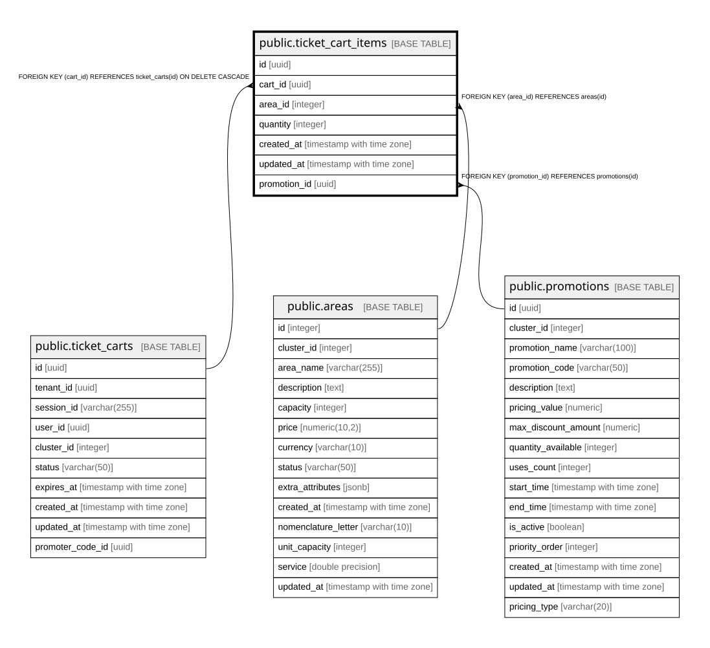

# public.ticket_cart_items

## Description

Items dentro de un carrito de boletas

## Columns

| Name | Type | Default | Nullable | Children | Parents | Comment |
| ---- | ---- | ------- | -------- | -------- | ------- | ------- |
| id | uuid | gen_random_uuid() | false |  |  |  |
| cart_id | uuid |  | false |  | [public.ticket_carts](public.ticket_carts.md) |  |
| area_id | integer |  | false |  | [public.areas](public.areas.md) |  |
| quantity | integer | 1 | false |  |  | Cantidad de bundles/tickets seleccionados |
| created_at | timestamp with time zone | now() | true |  |  |  |
| updated_at | timestamp with time zone | now() | true |  |  |  |
| promotion_id | uuid |  | true |  | [public.promotions](public.promotions.md) |  |

## Constraints

| Name | Type | Definition |
| ---- | ---- | ---------- |
| ticket_cart_items_area_id_fkey | FOREIGN KEY | FOREIGN KEY (area_id) REFERENCES areas(id) |
| ticket_cart_items_promotion_id_fkey | FOREIGN KEY | FOREIGN KEY (promotion_id) REFERENCES promotions(id) |
| ticket_cart_items_cart_id_fkey | FOREIGN KEY | FOREIGN KEY (cart_id) REFERENCES ticket_carts(id) ON DELETE CASCADE |
| ticket_cart_items_pkey | PRIMARY KEY | PRIMARY KEY (id) |

## Indexes

| Name | Definition |
| ---- | ---------- |
| ticket_cart_items_pkey | CREATE UNIQUE INDEX ticket_cart_items_pkey ON public.ticket_cart_items USING btree (id) |
| idx_ticket_cart_items_cart | CREATE INDEX idx_ticket_cart_items_cart ON public.ticket_cart_items USING btree (cart_id) |
| idx_ticket_cart_items_promotion | CREATE INDEX idx_ticket_cart_items_promotion ON public.ticket_cart_items USING btree (promotion_id) WHERE (promotion_id IS NOT NULL) |
| idx_ticket_cart_items_normal_unique | CREATE UNIQUE INDEX idx_ticket_cart_items_normal_unique ON public.ticket_cart_items USING btree (cart_id, area_id) WHERE (promotion_id IS NULL) |
| idx_ticket_cart_items_promo_unique | CREATE UNIQUE INDEX idx_ticket_cart_items_promo_unique ON public.ticket_cart_items USING btree (cart_id, area_id, promotion_id) WHERE (promotion_id IS NOT NULL) |
| idx_cart_items_individual_unique | CREATE UNIQUE INDEX idx_cart_items_individual_unique ON public.ticket_cart_items USING btree (cart_id, area_id) WHERE (promotion_id IS NULL) |
| idx_cart_items_promo_unique | CREATE UNIQUE INDEX idx_cart_items_promo_unique ON public.ticket_cart_items USING btree (cart_id, area_id, promotion_id) WHERE (promotion_id IS NOT NULL) |

## Relations

---

> Generated by [tbls](https://github.com/k1LoW/tbls)
