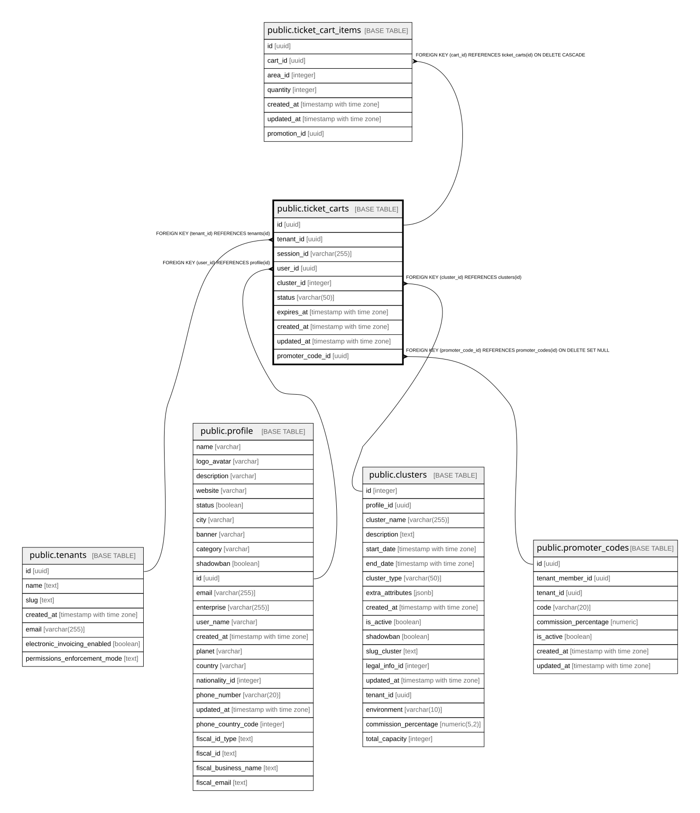

# public.ticket_carts

## Description

Carritos de compra para boletas de eventos

## Columns

| Name | Type | Default | Nullable | Children | Parents | Comment |
| ---- | ---- | ------- | -------- | -------- | ------- | ------- |
| id | uuid | gen_random_uuid() | false | [public.ticket_cart_items](public.ticket_cart_items.md) |  |  |
| tenant_id | uuid |  | false |  | [public.tenants](public.tenants.md) |  |
| session_id | varchar(255) |  | true |  |  | ID de sesion para usuarios anonimos |
| user_id | uuid |  | true |  | [public.profile](public.profile.md) |  |
| cluster_id | integer |  | true |  | [public.clusters](public.clusters.md) |  |
| status | varchar(50) | 'active'::character varying | true |  |  |  |
| expires_at | timestamp with time zone |  | true |  |  |  |
| created_at | timestamp with time zone | now() | true |  |  |  |
| updated_at | timestamp with time zone | now() | true |  |  |  |
| promoter_code_id | uuid |  | true |  | [public.promoter_codes](public.promoter_codes.md) |  |

## Constraints

| Name | Type | Definition |
| ---- | ---- | ---------- |
| ticket_carts_cluster_id_fkey | FOREIGN KEY | FOREIGN KEY (cluster_id) REFERENCES clusters(id) |
| ticket_carts_user_id_fkey | FOREIGN KEY | FOREIGN KEY (user_id) REFERENCES profile(id) |
| ticket_carts_tenant_id_fkey | FOREIGN KEY | FOREIGN KEY (tenant_id) REFERENCES tenants(id) |
| ticket_carts_pkey | PRIMARY KEY | PRIMARY KEY (id) |
| ticket_carts_promoter_code_fkey | FOREIGN KEY | FOREIGN KEY (promoter_code_id) REFERENCES promoter_codes(id) ON DELETE SET NULL |

## Indexes

| Name | Definition |
| ---- | ---------- |
| ticket_carts_pkey | CREATE UNIQUE INDEX ticket_carts_pkey ON public.ticket_carts USING btree (id) |
| idx_ticket_carts_session | CREATE INDEX idx_ticket_carts_session ON public.ticket_carts USING btree (session_id) WHERE (session_id IS NOT NULL) |
| idx_ticket_carts_user | CREATE INDEX idx_ticket_carts_user ON public.ticket_carts USING btree (user_id) WHERE (user_id IS NOT NULL) |
| idx_ticket_carts_cluster | CREATE INDEX idx_ticket_carts_cluster ON public.ticket_carts USING btree (cluster_id) |
| idx_ticket_carts_status | CREATE INDEX idx_ticket_carts_status ON public.ticket_carts USING btree (status) |
| idx_ticket_carts_promoter_code | CREATE INDEX idx_ticket_carts_promoter_code ON public.ticket_carts USING btree (promoter_code_id) WHERE (promoter_code_id IS NOT NULL) |

## Relations

---

> Generated by [tbls](https://github.com/k1LoW/tbls)
