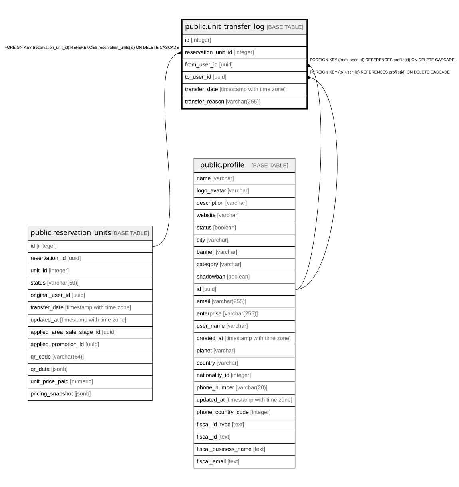

# public.unit_transfer_log

## Columns

| Name | Type | Default | Nullable | Children | Parents | Comment |
| ---- | ---- | ------- | -------- | -------- | ------- | ------- |
| id | integer | nextval('unit_transfer_log_id_seq'::regclass) | false |  |  |  |
| reservation_unit_id | integer |  | false |  | [public.reservation_units](public.reservation_units.md) |  |
| from_user_id | uuid |  | false |  | [public.profile](public.profile.md) |  |
| to_user_id | uuid |  | false |  | [public.profile](public.profile.md) |  |
| transfer_date | timestamp with time zone | CURRENT_TIMESTAMP | true |  |  |  |
| transfer_reason | varchar(255) |  | true |  |  |  |

## Constraints

| Name | Type | Definition |
| ---- | ---- | ---------- |
| fk_from_user | FOREIGN KEY | FOREIGN KEY (from_user_id) REFERENCES profile(id) ON DELETE CASCADE |
| fk_to_user | FOREIGN KEY | FOREIGN KEY (to_user_id) REFERENCES profile(id) ON DELETE CASCADE |
| fk_reservation_unit | FOREIGN KEY | FOREIGN KEY (reservation_unit_id) REFERENCES reservation_units(id) ON DELETE CASCADE |
| unit_transfer_log_pkey | PRIMARY KEY | PRIMARY KEY (id) |

## Indexes

| Name | Definition |
| ---- | ---------- |
| unit_transfer_log_pkey | CREATE UNIQUE INDEX unit_transfer_log_pkey ON public.unit_transfer_log USING btree (id) |

## Relations

---

> Generated by [tbls](https://github.com/k1LoW/tbls)
