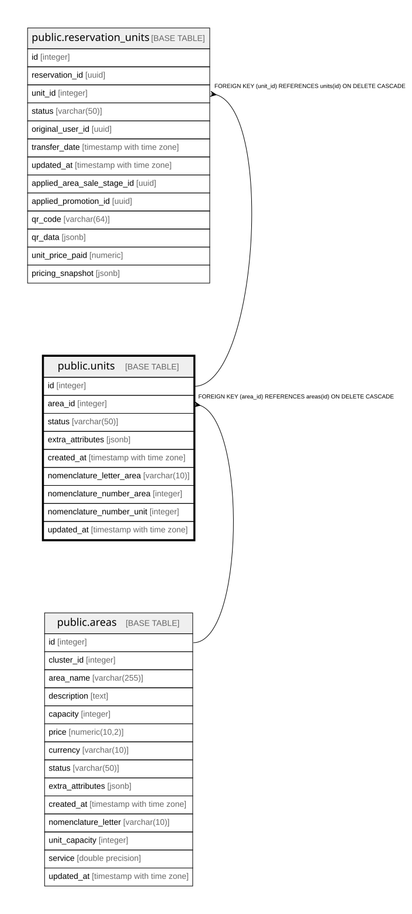

# public.units

## Columns

| Name | Type | Default | Nullable | Children | Parents | Comment |
| ---- | ---- | ------- | -------- | -------- | ------- | ------- |
| id | integer | nextval('units_id_seq'::regclass) | false | [public.reservation_units](public.reservation_units.md) |  |  |
| area_id | integer |  | false |  | [public.areas](public.areas.md) |  |
| status | varchar(50) | 'available'::character varying | true |  |  |  |
| extra_attributes | jsonb |  | true |  |  |  |
| created_at | timestamp with time zone | CURRENT_TIMESTAMP | true |  |  |  |
| nomenclature_letter_area | varchar(10) |  | true |  |  |  |
| nomenclature_number_area | integer |  | true |  |  |  |
| nomenclature_number_unit | integer |  | true |  |  |  |
| updated_at | timestamp with time zone | now() | true |  |  |  |

## Constraints

| Name | Type | Definition |
| ---- | ---- | ---------- |
| fk_area | FOREIGN KEY | FOREIGN KEY (area_id) REFERENCES areas(id) ON DELETE CASCADE |
| units_pkey | PRIMARY KEY | PRIMARY KEY (id) |

## Indexes

| Name | Definition |
| ---- | ---------- |
| units_pkey | CREATE UNIQUE INDEX units_pkey ON public.units USING btree (id) |
| idx_units_status | CREATE INDEX idx_units_status ON public.units USING btree (status) WHERE ((status)::text = 'reserved'::text) |

## Relations

---

> Generated by [tbls](https://github.com/k1LoW/tbls)
