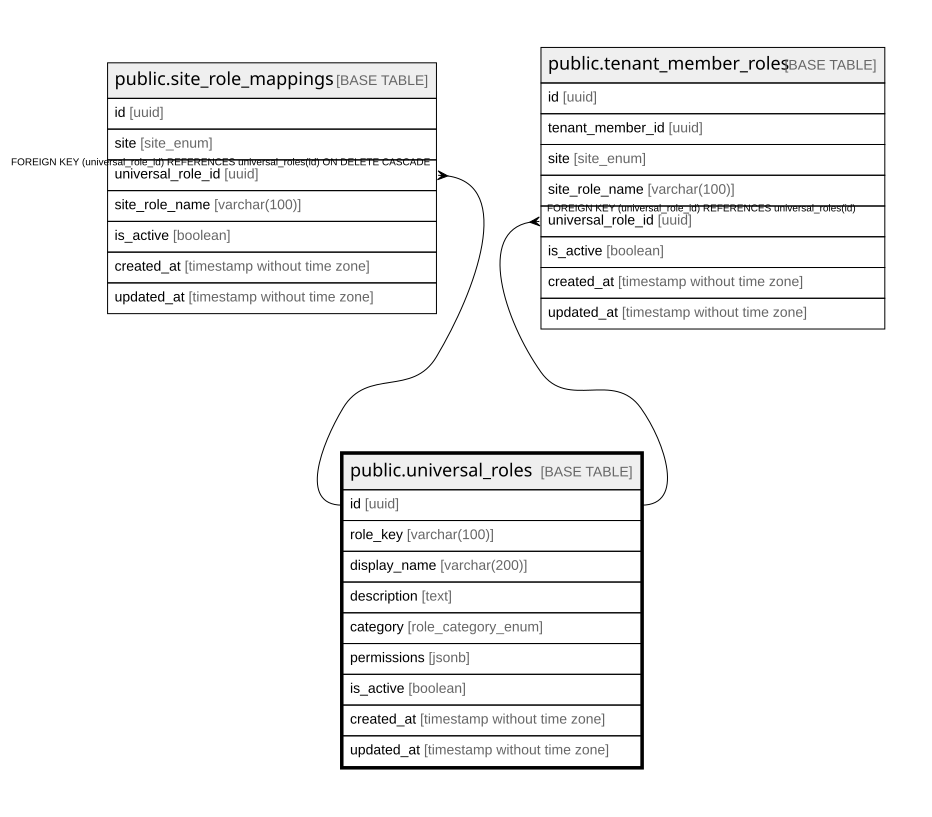

# public.universal_roles

## Columns

| Name | Type | Default | Nullable | Children | Parents | Comment |
| ---- | ---- | ------- | -------- | -------- | ------- | ------- |
| id | uuid | gen_random_uuid() | false | [public.site_role_mappings](public.site_role_mappings.md) [public.tenant_member_roles](public.tenant_member_roles.md) |  |  |
| role_key | varchar(100) |  | false |  |  |  |
| display_name | varchar(200) |  | false |  |  |  |
| description | text |  | true |  |  |  |
| category | role_category_enum |  | false |  |  |  |
| permissions | jsonb | '{}'::jsonb | true |  |  |  |
| is_active | boolean | true | true |  |  |  |
| created_at | timestamp without time zone | now() | true |  |  |  |
| updated_at | timestamp without time zone | now() | true |  |  |  |

## Constraints

| Name | Type | Definition |
| ---- | ---- | ---------- |
| universal_roles_pkey | PRIMARY KEY | PRIMARY KEY (id) |
| universal_roles_role_key_key | UNIQUE | UNIQUE (role_key) |

## Indexes

| Name | Definition |
| ---- | ---------- |
| universal_roles_pkey | CREATE UNIQUE INDEX universal_roles_pkey ON public.universal_roles USING btree (id) |
| universal_roles_role_key_key | CREATE UNIQUE INDEX universal_roles_role_key_key ON public.universal_roles USING btree (role_key) |
| idx_universal_roles_category | CREATE INDEX idx_universal_roles_category ON public.universal_roles USING btree (category) |
| idx_universal_roles_key | CREATE INDEX idx_universal_roles_key ON public.universal_roles USING btree (role_key) |

## Triggers

| Name | Definition |
| ---- | ---------- |
| update_universal_roles_updated_at | CREATE TRIGGER update_universal_roles_updated_at BEFORE UPDATE ON public.universal_roles FOR EACH ROW EXECUTE FUNCTION update_updated_at_column() |

## Relations

---

> Generated by [tbls](https://github.com/k1LoW/tbls)
