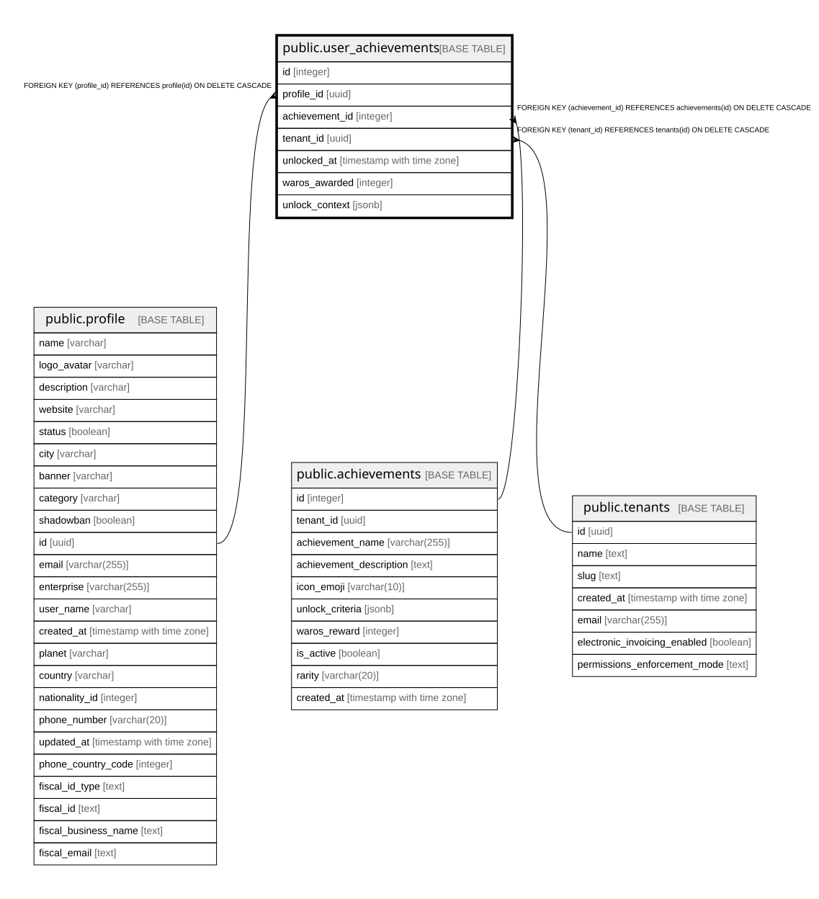

# public.user_achievements

## Columns

| Name | Type | Default | Nullable | Children | Parents | Comment |
| ---- | ---- | ------- | -------- | -------- | ------- | ------- |
| id | integer | nextval('user_achievements_id_seq'::regclass) | false |  |  |  |
| profile_id | uuid |  | false |  | [public.profile](public.profile.md) |  |
| achievement_id | integer |  | false |  | [public.achievements](public.achievements.md) |  |
| tenant_id | uuid |  | false |  | [public.tenants](public.tenants.md) |  |
| unlocked_at | timestamp with time zone | now() | true |  |  |  |
| waros_awarded | integer | 0 | true |  |  |  |
| unlock_context | jsonb | '{}'::jsonb | true |  |  |  |

## Constraints

| Name | Type | Definition |
| ---- | ---- | ---------- |
| user_achievements_achievement_id_fkey | FOREIGN KEY | FOREIGN KEY (achievement_id) REFERENCES achievements(id) ON DELETE CASCADE |
| user_achievements_profile_id_fkey | FOREIGN KEY | FOREIGN KEY (profile_id) REFERENCES profile(id) ON DELETE CASCADE |
| user_achievements_tenant_id_fkey | FOREIGN KEY | FOREIGN KEY (tenant_id) REFERENCES tenants(id) ON DELETE CASCADE |
| user_achievements_pkey | PRIMARY KEY | PRIMARY KEY (id) |
| user_achievements_profile_id_achievement_id_key | UNIQUE | UNIQUE (profile_id, achievement_id) |

## Indexes

| Name | Definition |
| ---- | ---------- |
| user_achievements_pkey | CREATE UNIQUE INDEX user_achievements_pkey ON public.user_achievements USING btree (id) |
| user_achievements_profile_id_achievement_id_key | CREATE UNIQUE INDEX user_achievements_profile_id_achievement_id_key ON public.user_achievements USING btree (profile_id, achievement_id) |
| idx_user_achievements_profile | CREATE INDEX idx_user_achievements_profile ON public.user_achievements USING btree (profile_id, unlocked_at DESC) |

## Relations

---

> Generated by [tbls](https://github.com/k1LoW/tbls)
