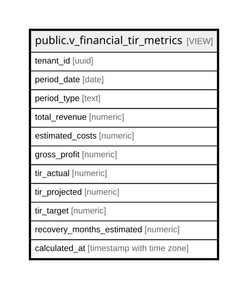

# public.v_financial_tir_metrics

## Description

<details>
<summary><strong>Table Definition</strong></summary>

```sql
CREATE VIEW v_financial_tir_metrics AS (
 WITH monthly_sales AS (
         SELECT COALESCE(tm.tenant_id, '00000000-0000-0000-0000-000000000000'::uuid) AS tenant_id,
            (date_trunc('month'::text, o.order_date))::date AS period_date,
            sum(o.total_amount) AS total_revenue,
            count(o.id) AS total_orders,
            avg(o.total_amount) AS avg_order_value
           FROM (orders o
             LEFT JOIN tenant_members tm ON ((o.user_id = tm.user_id)))
          WHERE (o.order_date >= (CURRENT_DATE - '1 year'::interval))
          GROUP BY tm.tenant_id, (date_trunc('month'::text, o.order_date))
        ), monthly_costs AS (
         SELECT ms.tenant_id,
            ms.period_date,
            ms.total_revenue,
            (ms.total_revenue * 0.35) AS estimated_costs,
            (ms.total_revenue - (ms.total_revenue * 0.35)) AS gross_profit
           FROM monthly_sales ms
        ), tir_calculations AS (
         SELECT mc.tenant_id,
            mc.period_date,
            mc.total_revenue,
            mc.estimated_costs,
            mc.gross_profit,
                CASE
                    WHEN (mc.total_revenue > (0)::numeric) THEN ((mc.gross_profit / mc.total_revenue) * (100)::numeric)
                    ELSE (0)::numeric
                END AS monthly_margin,
            lag(mc.gross_profit, 1) OVER (PARTITION BY mc.tenant_id ORDER BY mc.period_date) AS prev_profit
           FROM monthly_costs mc
        )
 SELECT tenant_id,
    period_date,
    'monthly'::text AS period_type,
    total_revenue,
    estimated_costs,
    gross_profit,
    monthly_margin AS tir_actual,
        CASE
            WHEN ((prev_profit IS NOT NULL) AND (prev_profit > (0)::numeric)) THEN (monthly_margin * 1.15)
            ELSE monthly_margin
        END AS tir_projected,
    10.0 AS tir_target,
        CASE
            WHEN (gross_profit > (0)::numeric) THEN (total_revenue / gross_profit)
            ELSE (0)::numeric
        END AS recovery_months_estimated,
    now() AS calculated_at
   FROM tir_calculations tc
  ORDER BY tenant_id, period_date DESC
)
```

</details>

## Columns

| Name | Type | Default | Nullable | Children | Parents | Comment |
| ---- | ---- | ------- | -------- | -------- | ------- | ------- |
| tenant_id | uuid |  | true |  |  |  |
| period_date | date |  | true |  |  |  |
| period_type | text |  | true |  |  |  |
| total_revenue | numeric |  | true |  |  |  |
| estimated_costs | numeric |  | true |  |  |  |
| gross_profit | numeric |  | true |  |  |  |
| tir_actual | numeric |  | true |  |  |  |
| tir_projected | numeric |  | true |  |  |  |
| tir_target | numeric |  | true |  |  |  |
| recovery_months_estimated | numeric |  | true |  |  |  |
| calculated_at | timestamp with time zone |  | true |  |  |  |

## Referenced Tables

| Name | Columns | Comment | Type |
| ---- | ------- | ------- | ---- |
| [public.orders](public.orders.md) | 41 |  | BASE TABLE |
| [public.tenant_members](public.tenant_members.md) | 6 |  | BASE TABLE |
| [monthly_costs](monthly_costs.md) | 0 |  |  |
| [tir_calculations](tir_calculations.md) | 0 |  |  |

## Relations



---

> Generated by [tbls](https://github.com/k1LoW/tbls)
