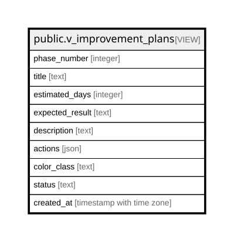

# public.v_improvement_plans

## Description

<details>
<summary><strong>Table Definition</strong></summary>

```sql
CREATE VIEW v_improvement_plans AS (
 WITH improvement_phases AS (
         SELECT 1 AS phase_number,
            'Fase 1: Acciones Inmediatas'::text AS title,
            30 AS estimated_days,
            '+1.2% TIR, reducción costos 3%'::text AS expected_result,
            'Acciones que se pueden implementar de inmediato'::text AS description,
            json_build_array(json_build_object('name', 'Renegociar Proveedores', 'description', 'Contactar 3 proveedores principales para mejores precios', 'impact', 0.8, 'effort', 'Alto'), json_build_object('name', 'Estandarizar Porciones', 'description', 'Implementar control exacto en 8 platos principales', 'impact', 0.4, 'effort', 'Medio')) AS actions
        UNION ALL
         SELECT 2 AS phase_number,
            'Fase 2: Optimización Media'::text AS title,
            60 AS estimated_days,
            '+0.9% TIR adicional, eficiencia +15%'::text AS expected_result,
            'Optimizaciones de proceso y capacitación'::text AS description,
            json_build_array(json_build_object('name', 'Sistema FIFO', 'description', 'Implementar rotación First In, First Out + tecnología', 'impact', 0.5, 'effort', 'Medio'), json_build_object('name', 'Training Staff', 'description', 'Entrenar equipo en upselling y venta sugestiva', 'impact', 0.4, 'effort', 'Bajo')) AS actions
        UNION ALL
         SELECT 3 AS phase_number,
            'Fase 3: Transformación Completa'::text AS title,
            90 AS estimated_days,
            '+0.6% TIR final, sistema optimizado'::text AS expected_result,
            'Cambios estructurales y automatización'::text AS description,
            json_build_array(json_build_object('name', 'Reforma de Menú', 'description', 'Eliminar productos <50% margen, introducir premium', 'impact', 0.4, 'effort', 'Alto'), json_build_object('name', 'Automatización', 'description', 'Sistemas de gestión + predicción en tiempo real', 'impact', 0.2, 'effort', 'Alto')) AS actions
        )
 SELECT phase_number,
    title,
    estimated_days,
    expected_result,
    description,
    actions,
        CASE
            WHEN (phase_number = 1) THEN 'bg-green-500'::text
            WHEN (phase_number = 2) THEN 'bg-yellow-500'::text
            ELSE 'bg-purple-500'::text
        END AS color_class,
    'Planned'::text AS status,
    now() AS created_at
   FROM improvement_phases
  ORDER BY phase_number
)
```

</details>

## Columns

| Name | Type | Default | Nullable | Children | Parents | Comment |
| ---- | ---- | ------- | -------- | -------- | ------- | ------- |
| phase_number | integer |  | true |  |  |  |
| title | text |  | true |  |  |  |
| estimated_days | integer |  | true |  |  |  |
| expected_result | text |  | true |  |  |  |
| description | text |  | true |  |  |  |
| actions | json |  | true |  |  |  |
| color_class | text |  | true |  |  |  |
| status | text |  | true |  |  |  |
| created_at | timestamp with time zone |  | true |  |  |  |

## Relations



---

> Generated by [tbls](https://github.com/k1LoW/tbls)
