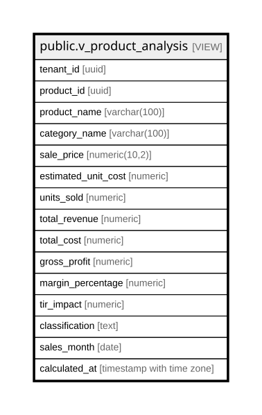

# public.v_product_analysis

## Description

<details>
<summary><strong>Table Definition</strong></summary>

```sql
CREATE VIEW v_product_analysis AS (
 WITH product_sales AS (
         SELECT COALESCE(tm.tenant_id, '00000000-0000-0000-0000-000000000000'::uuid) AS tenant_id,
            p.id AS product_id,
            p.name AS product_name,
            c.name AS category_name,
            p.price AS sale_price,
            sum(oi.quantity) AS units_sold,
            sum(oi.subtotal) AS total_revenue,
            count(DISTINCT o.id) AS order_count,
            (date_trunc('month'::text, o.order_date))::date AS sales_month
           FROM (((((order_items oi
             JOIN orders o ON ((oi.order_id = o.id)))
             JOIN product_variants pv ON ((oi.variant_id = pv.id)))
             JOIN product p ON ((pv.product_id = p.id)))
             JOIN categories c ON ((p.category_id = c.id)))
             LEFT JOIN tenant_members tm ON ((o.user_id = tm.user_id)))
          WHERE (o.order_date >= (CURRENT_DATE - '3 mons'::interval))
          GROUP BY tm.tenant_id, p.id, p.name, c.name, p.price, (date_trunc('month'::text, o.order_date))
        ), product_metrics AS (
         SELECT ps.tenant_id,
            ps.product_id,
            ps.product_name,
            ps.category_name,
            ps.sale_price,
            ps.units_sold,
            ps.total_revenue,
            ps.order_count,
            ps.sales_month,
            (ps.sale_price * 0.40) AS estimated_unit_cost,
            (ps.total_revenue * 0.40) AS total_cost,
            (ps.total_revenue - (ps.total_revenue * 0.40)) AS gross_profit,
                CASE
                    WHEN (ps.total_revenue > (0)::numeric) THEN (((ps.total_revenue - (ps.total_revenue * 0.40)) / ps.total_revenue) * (100)::numeric)
                    ELSE (0)::numeric
                END AS margin_percentage
           FROM product_sales ps
        ), product_performance AS (
         SELECT pm.tenant_id,
            pm.product_id,
            pm.product_name,
            pm.category_name,
            pm.sale_price,
            pm.units_sold,
            pm.total_revenue,
            pm.order_count,
            pm.sales_month,
            pm.estimated_unit_cost,
            pm.total_cost,
            pm.gross_profit,
            pm.margin_percentage,
                CASE
                    WHEN ((pm.margin_percentage >= (70)::numeric) AND (pm.units_sold >= (10)::numeric)) THEN round(((pm.margin_percentage / 100.0) * (pm.units_sold / 50.0)), 1)
                    WHEN ((pm.margin_percentage >= (50)::numeric) AND (pm.units_sold >= (5)::numeric)) THEN round(((pm.margin_percentage / 100.0) * (pm.units_sold / 100.0)), 1)
                    ELSE round(('-0.1'::numeric * ((1)::numeric - (pm.margin_percentage / 100.0))), 1)
                END AS tir_impact,
                CASE
                    WHEN ((pm.margin_percentage >= (70)::numeric) AND (pm.units_sold >= (10)::numeric)) THEN 'Estrella'::text
                    WHEN ((pm.margin_percentage >= (60)::numeric) AND (pm.units_sold >= (5)::numeric)) THEN 'Potencial'::text
                    WHEN ((pm.margin_percentage < (50)::numeric) OR (pm.units_sold < (3)::numeric)) THEN 'Problemático'::text
                    ELSE 'Bajo Rendimiento'::text
                END AS classification
           FROM product_metrics pm
        )
 SELECT tenant_id,
    product_id,
    product_name,
    category_name,
    sale_price,
    estimated_unit_cost,
    units_sold,
    total_revenue,
    total_cost,
    gross_profit,
    margin_percentage,
    tir_impact,
    classification,
    sales_month,
    now() AS calculated_at
   FROM product_performance pp
  ORDER BY tenant_id, tir_impact DESC, margin_percentage DESC
)
```

</details>

## Columns

| Name | Type | Default | Nullable | Children | Parents | Comment |
| ---- | ---- | ------- | -------- | -------- | ------- | ------- |
| tenant_id | uuid |  | true |  |  |  |
| product_id | uuid |  | true |  |  |  |
| product_name | varchar(100) |  | true |  |  |  |
| category_name | varchar(100) |  | true |  |  |  |
| sale_price | numeric(10,2) |  | true |  |  |  |
| estimated_unit_cost | numeric |  | true |  |  |  |
| units_sold | numeric |  | true |  |  |  |
| total_revenue | numeric |  | true |  |  |  |
| total_cost | numeric |  | true |  |  |  |
| gross_profit | numeric |  | true |  |  |  |
| margin_percentage | numeric |  | true |  |  |  |
| tir_impact | numeric |  | true |  |  |  |
| classification | text |  | true |  |  |  |
| sales_month | date |  | true |  |  |  |
| calculated_at | timestamp with time zone |  | true |  |  |  |

## Referenced Tables

| Name | Columns | Comment | Type |
| ---- | ------- | ------- | ---- |
| [public.order_items](public.order_items.md) | 17 |  | BASE TABLE |
| [public.orders](public.orders.md) | 43 |  | BASE TABLE |
| [public.product_variants](public.product_variants.md) | 9 |  | BASE TABLE |
| [public.product](public.product.md) | 27 |  | BASE TABLE |
| [public.categories](public.categories.md) | 7 |  | BASE TABLE |
| [public.tenant_members](public.tenant_members.md) | 6 |  | BASE TABLE |
| [product_metrics](product_metrics.md) | 0 |  |  |
| [product_performance](product_performance.md) | 0 |  |  |

## Relations



---

> Generated by [tbls](https://github.com/k1LoW/tbls)
