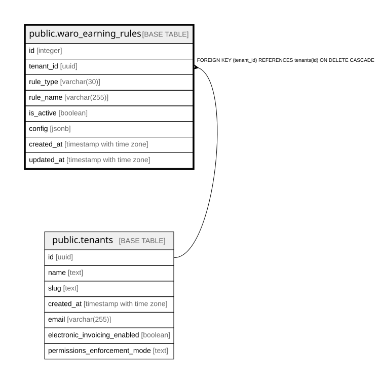

# public.waro_earning_rules

## Columns

| Name | Type | Default | Nullable | Children | Parents | Comment |
| ---- | ---- | ------- | -------- | -------- | ------- | ------- |
| id | integer | nextval('waro_earning_rules_id_seq'::regclass) | false |  |  |  |
| tenant_id | uuid |  | false |  | [public.tenants](public.tenants.md) |  |
| rule_type | varchar(30) |  | false |  |  |  |
| rule_name | varchar(255) |  | false |  |  |  |
| is_active | boolean | false | false |  |  |  |
| config | jsonb | '{}'::jsonb | false |  |  |  |
| created_at | timestamp with time zone | now() | false |  |  |  |
| updated_at | timestamp with time zone | now() | false |  |  |  |

## Constraints

| Name | Type | Definition |
| ---- | ---- | ---------- |
| waro_earning_rules_valid_type | CHECK | CHECK (((rule_type)::text = ANY ((ARRAY['ticket_value'::character varying, 'purchase_count'::character varying, 'frequency'::character varying, 'per_ticket_qty'::character varying])::text[]))) |
| waro_earning_rules_tenant_id_fkey | FOREIGN KEY | FOREIGN KEY (tenant_id) REFERENCES tenants(id) ON DELETE CASCADE |
| waro_earning_rules_pkey | PRIMARY KEY | PRIMARY KEY (id) |
| waro_earning_rules_tenant_type_unique | UNIQUE | UNIQUE (tenant_id, rule_type) |

## Indexes

| Name | Definition |
| ---- | ---------- |
| waro_earning_rules_pkey | CREATE UNIQUE INDEX waro_earning_rules_pkey ON public.waro_earning_rules USING btree (id) |
| waro_earning_rules_tenant_type_unique | CREATE UNIQUE INDEX waro_earning_rules_tenant_type_unique ON public.waro_earning_rules USING btree (tenant_id, rule_type) |
| idx_waro_earning_rules_tenant | CREATE INDEX idx_waro_earning_rules_tenant ON public.waro_earning_rules USING btree (tenant_id, is_active) |

## Relations

---

> Generated by [tbls](https://github.com/k1LoW/tbls)
