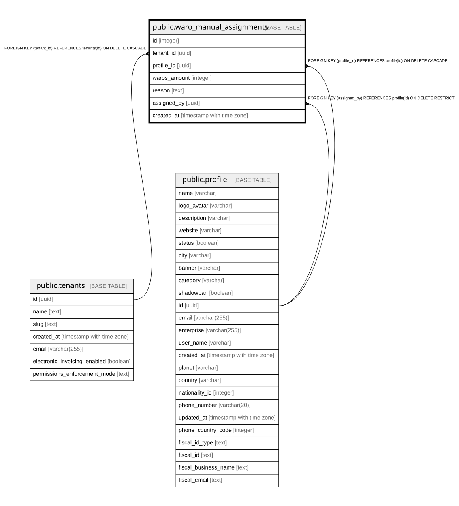

# public.waro_manual_assignments

## Columns

| Name | Type | Default | Nullable | Children | Parents | Comment |
| ---- | ---- | ------- | -------- | -------- | ------- | ------- |
| id | integer | nextval('waro_manual_assignments_id_seq'::regclass) | false |  |  |  |
| tenant_id | uuid |  | false |  | [public.tenants](public.tenants.md) |  |
| profile_id | uuid |  | false |  | [public.profile](public.profile.md) |  |
| waros_amount | integer |  | false |  |  |  |
| reason | text |  | true |  |  |  |
| assigned_by | uuid |  | false |  | [public.profile](public.profile.md) |  |
| created_at | timestamp with time zone | now() | false |  |  |  |

## Constraints

| Name | Type | Definition |
| ---- | ---- | ---------- |
| waro_manual_assignments_nonzero | CHECK | CHECK ((waros_amount <> 0)) |
| waro_manual_assignments_assigned_by_fkey | FOREIGN KEY | FOREIGN KEY (assigned_by) REFERENCES profile(id) ON DELETE RESTRICT |
| waro_manual_assignments_profile_id_fkey | FOREIGN KEY | FOREIGN KEY (profile_id) REFERENCES profile(id) ON DELETE CASCADE |
| waro_manual_assignments_tenant_id_fkey | FOREIGN KEY | FOREIGN KEY (tenant_id) REFERENCES tenants(id) ON DELETE CASCADE |
| waro_manual_assignments_pkey | PRIMARY KEY | PRIMARY KEY (id) |

## Indexes

| Name | Definition |
| ---- | ---------- |
| waro_manual_assignments_pkey | CREATE UNIQUE INDEX waro_manual_assignments_pkey ON public.waro_manual_assignments USING btree (id) |
| idx_waro_manual_assignments_tenant_date | CREATE INDEX idx_waro_manual_assignments_tenant_date ON public.waro_manual_assignments USING btree (tenant_id, created_at DESC) |
| idx_waro_manual_assignments_profile | CREATE INDEX idx_waro_manual_assignments_profile ON public.waro_manual_assignments USING btree (profile_id) |

## Relations

---

> Generated by [tbls](https://github.com/k1LoW/tbls)
