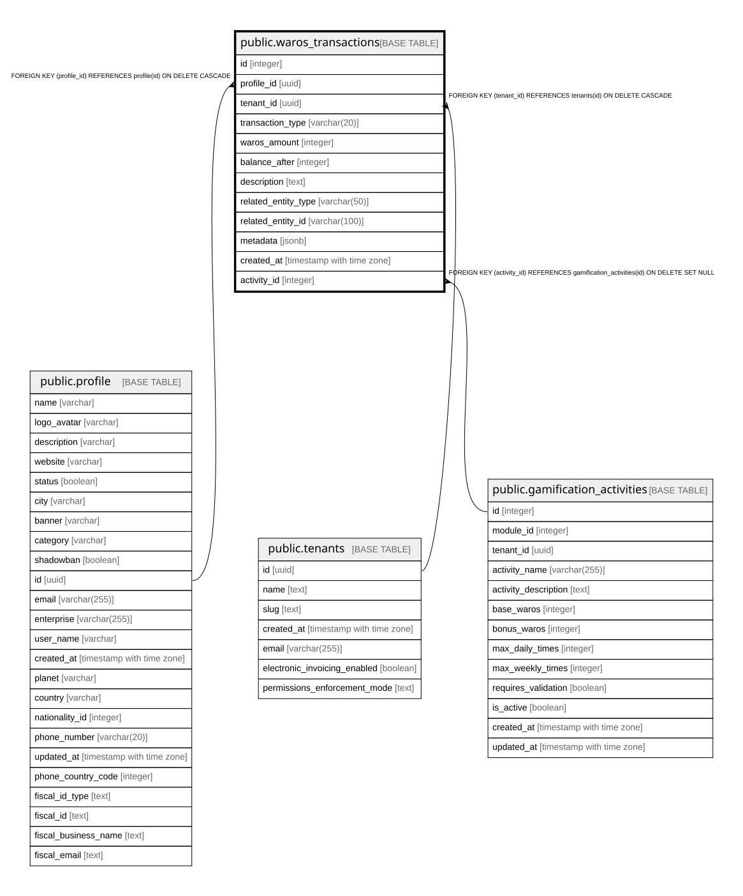

# public.waros_transactions

## Columns

| Name | Type | Default | Nullable | Children | Parents | Comment |
| ---- | ---- | ------- | -------- | -------- | ------- | ------- |
| id | integer | nextval('waros_transactions_id_seq'::regclass) | false |  |  |  |
| profile_id | uuid |  | false |  | [public.profile](public.profile.md) |  |
| tenant_id | uuid |  | false |  | [public.tenants](public.tenants.md) |  |
| transaction_type | varchar(20) |  | false |  |  |  |
| waros_amount | integer |  | false |  |  |  |
| balance_after | integer |  | false |  |  |  |
| description | text |  | false |  |  |  |
| related_entity_type | varchar(50) |  | true |  |  |  |
| related_entity_id | varchar(100) |  | true |  |  |  |
| metadata | jsonb | '{}'::jsonb | true |  |  |  |
| created_at | timestamp with time zone | now() | true |  |  |  |
| activity_id | integer |  | true |  | [public.gamification_activities](public.gamification_activities.md) |  |

## Constraints

| Name | Type | Definition |
| ---- | ---- | ---------- |
| fk_waros_transactions_activity | FOREIGN KEY | FOREIGN KEY (activity_id) REFERENCES gamification_activities(id) ON DELETE SET NULL |
| waros_transactions_profile_id_fkey | FOREIGN KEY | FOREIGN KEY (profile_id) REFERENCES profile(id) ON DELETE CASCADE |
| waros_transactions_tenant_id_fkey | FOREIGN KEY | FOREIGN KEY (tenant_id) REFERENCES tenants(id) ON DELETE CASCADE |
| waros_transactions_pkey | PRIMARY KEY | PRIMARY KEY (id) |

## Indexes

| Name | Definition |
| ---- | ---------- |
| waros_transactions_pkey | CREATE UNIQUE INDEX waros_transactions_pkey ON public.waros_transactions USING btree (id) |
| idx_waros_transactions_activity_id | CREATE INDEX idx_waros_transactions_activity_id ON public.waros_transactions USING btree (activity_id) |
| idx_waros_transactions_profile_date | CREATE INDEX idx_waros_transactions_profile_date ON public.waros_transactions USING btree (profile_id, created_at DESC) |

## Relations

---

> Generated by [tbls](https://github.com/k1LoW/tbls)
