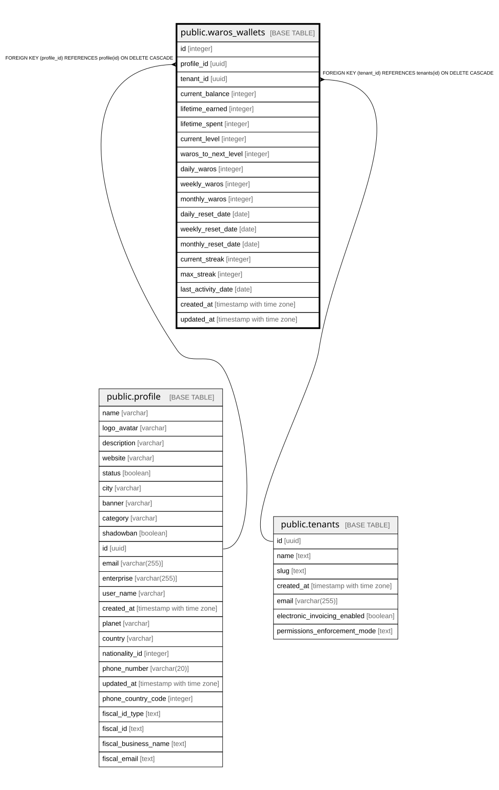

# public.waros_wallets

## Columns

| Name | Type | Default | Nullable | Children | Parents | Comment |
| ---- | ---- | ------- | -------- | -------- | ------- | ------- |
| id | integer | nextval('waros_wallets_id_seq'::regclass) | false |  |  |  |
| profile_id | uuid |  | false |  | [public.profile](public.profile.md) |  |
| tenant_id | uuid |  | false |  | [public.tenants](public.tenants.md) |  |
| current_balance | integer | 0 | true |  |  |  |
| lifetime_earned | integer | 0 | true |  |  |  |
| lifetime_spent | integer | 0 | true |  |  |  |
| current_level | integer | 1 | true |  |  |  |
| waros_to_next_level | integer | 100 | true |  |  |  |
| daily_waros | integer | 0 | true |  |  |  |
| weekly_waros | integer | 0 | true |  |  |  |
| monthly_waros | integer | 0 | true |  |  |  |
| daily_reset_date | date | CURRENT_DATE | true |  |  |  |
| weekly_reset_date | date | CURRENT_DATE | true |  |  |  |
| monthly_reset_date | date | CURRENT_DATE | true |  |  |  |
| current_streak | integer | 0 | true |  |  |  |
| max_streak | integer | 0 | true |  |  |  |
| last_activity_date | date | CURRENT_DATE | true |  |  |  |
| created_at | timestamp with time zone | now() | true |  |  |  |
| updated_at | timestamp with time zone | now() | true |  |  |  |

## Constraints

| Name | Type | Definition |
| ---- | ---- | ---------- |
| waros_wallets_profile_id_fkey | FOREIGN KEY | FOREIGN KEY (profile_id) REFERENCES profile(id) ON DELETE CASCADE |
| waros_wallets_tenant_id_fkey | FOREIGN KEY | FOREIGN KEY (tenant_id) REFERENCES tenants(id) ON DELETE CASCADE |
| waros_wallets_pkey | PRIMARY KEY | PRIMARY KEY (id) |
| waros_wallets_profile_id_tenant_id_key | UNIQUE | UNIQUE (profile_id, tenant_id) |

## Indexes

| Name | Definition |
| ---- | ---------- |
| waros_wallets_pkey | CREATE UNIQUE INDEX waros_wallets_pkey ON public.waros_wallets USING btree (id) |
| waros_wallets_profile_id_tenant_id_key | CREATE UNIQUE INDEX waros_wallets_profile_id_tenant_id_key ON public.waros_wallets USING btree (profile_id, tenant_id) |
| idx_waros_wallets_tenant_profile | CREATE INDEX idx_waros_wallets_tenant_profile ON public.waros_wallets USING btree (tenant_id, profile_id) |

## Relations

---

> Generated by [tbls](https://github.com/k1LoW/tbls)
