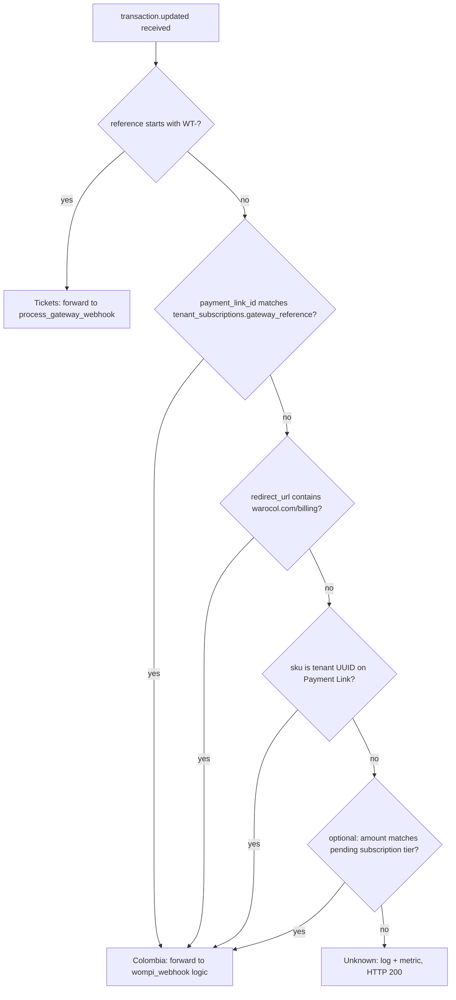

# Wompi webhook routing matrix (Tickets vs Colombia)

**Status:** Classification rules for epic [#351](https://github.com/uno0uno/api-warolabs/issues/351) — router implementation is [#353](https://github.com/uno0uno/api-warolabs/issues/353).  
**Issue:** [#352](https://github.com/uno0uno/api-warolabs/issues/352)  
**Last updated:** 2026-06-01

Wompi sends `transaction.updated` events to a **single merchant webhook URL**. Today that URL points at **api.warotickets.com**, so Colombia billing (`tenant_subscriptions`) never receives events. Epic #351 adds a **central ingress** on **api.warocol.com** that verifies the signature once and **dispatches** to existing handlers without rewriting them.

This document defines **how to classify** an event before dispatch. It does not change handler code.

---

## Event shape (relevant fields)

Wompi payload (simplified):

```json
{
  "event": "transaction.updated",
  "data": {
    "transaction": {
      "id": "...",
      "status": "APPROVED",
      "reference": "WT-abc12345-1717200000",
      "payment_link_id": "SD7wnV",
      "amount_in_cents": 120000000,
      "redirect_url": "https://warocol.com/billing/confirmacion"
    }
  },
  "signature": { "properties": [...], "checksum": "..." }
}
```

Fields used for routing:

| Field | Source | Notes |
|-------|--------|-------|
| `reference` | `data.transaction.reference` | Tickets sets `WT-{reservation_id[:8]}-{unix_ts}` at checkout |
| `payment_link_id` | `data.transaction.payment_link_id` | Colombia stores Wompi Payment Link id as `tenant_subscriptions.gateway_reference` |
| `redirect_url` | Payment Link metadata / transaction | Colombia links use `{host}/billing/confirmacion` |
| `sku` | Payment Link creation payload | Colombia: `str(tenant_id)[:36]` (UUID), **not** catalog `product_variants.sku` |
| `amount_in_cents` | `data.transaction.amount_in_cents` | **Secondary** — plan-specific subscription amounts vs ticket totals; do not use as primary classifier |

---

## Routing matrix

| Priority | Signal | Rule | Route | Confidence |
|----------|--------|------|-------|------------|
| 1 | `reference` | Starts with `WT-` | **Tickets** | High — assigned at payment creation |
| 2 | `payment_link_id` | Row exists in warocol `tenant_subscriptions.gateway_reference` | **Colombia** | High — DB lookup on dispatch host |
| 3 | `redirect_url` | Contains `warocol.com/billing` (or configured billing confirm path) | **Colombia** | Medium — set when creating Payment Link |
| 4 | `sku` | Valid UUID matching a `tenants.id` (Payment Link `sku` field) | **Colombia** | Medium — set in `wompi_service.create_payment_link` |
| 5 | `amount_in_cents` | Matches known subscription tier for a pending link (optional heuristic) | **Colombia** or **unknown** | Low — amounts overlap across products; log if used |
| — | (none of the above) | — | **Unknown** | — |

**Tie-break:** If `reference` is `WT-*`, route **Tickets** even if other fields are present (Tickets reference is authoritative for that product line).

---

## Decision tree



**Unknown policy:** Respond **HTTP 200** with a generic ack so Wompi does not retry indefinitely. Log structured fields (`transaction.id`, `reference`, `payment_link_id`, `redirect_url`, `sku`, `amount_in_cents`) and increment a metric/alert for manual review. Do not forward unclassified payloads to Tickets or Colombia handlers.

---

## Existing handlers (link only — no rewrite)

### Colombia (api.warocol.com / api-warolabs)

| Item | Location |
|------|----------|
| Webhook today | `POST /billing/webhook` — [`app/routers/billing.py`](../../app/routers/billing.py) (`wompi_webhook`, ~L211–297) |
| Signature | [`app/services/wompi_service.py`](../../app/services/wompi_service.py) `verify_event_signature` (~L121–148) |
| Activation (webhook) | [`app/services/billing_service.py`](../../app/services/billing_service.py) `activate_tenant_subscription` (~L531–595) — requires `status = 'pending'` today |
| Return path | `GET /billing/verify-payment` → `activate_subscription_by_gateway_ref` (~L126–158) |
| Payment Link creation | [`app/routers/billing.py`](../../app/routers/billing.py) subscribe flow (~L95–112), [`app/services/wompi_service.py`](../../app/services/wompi_service.py) `create_payment_link` (`redirect_url`, `sku` ~L68–69) |
| Success response | `{"received": true}` |

### Tickets (api.warotickets.com / api_warotickets)

| Item | Location |
|------|----------|
| Webhook today | `POST /payments/webhooks/wompi` — `api_warotickets/app/routers/payments.py` (~L106–115) |
| Processing | `api_warotickets/app/services/payments_service.py` `process_gateway_webhook` (~L261–343) |
| Reference format | `payments_service.py` ~L103: `WT-{reservation_id[:8]}-{timestamp}` |
| Idempotency | ~L288–289: skips re-confirm if payment already `approved` |
| Success response | `{"status": "received"}` |

**Diagnostic:** If Wompi or logs show `{"status":"received"}`, Tickets handled the event. If `{"received": true}`, Colombia handled it.

### Future central ingress (#353)

| Item | Value |
|------|--------|
| Target public URL | `https://api.warocol.com/payments/webhooks/wompi` |
| Behavior | Verify signature once → classify per this doc → HTTP forward to handler above |
| Colombia legacy URL | Keep `POST /billing/webhook` during transition or proxy from router |

---

## Edge cases

### Shared Wompi merchant account

Colombia and Tickets use the same Wompi merchant and `WOMPI_EVENTS_SECRET`. The router (#353) should verify the event signature **once** at ingress, then forward the raw JSON (Tickets may re-verify; internal forward auth is [#46](https://github.com/uno0uno/api_warotickets/issues/46)).

### Duplicate delivery

Wompi may deliver the same `transaction.updated` more than once.

| Product | Behavior today | Expectation after router |
|---------|----------------|---------------------------|
| Tickets | `was_already_approved` guard (~L288–289) | Unchanged |
| Colombia | Webhook inserts `billing_events` on activate | Avoid duplicate `payment_approved` if both webhook and `verify-payment` run; document in #354 |

### Idempotency expectations

- **Tickets:** Safe to call `process_gateway_webhook` repeatedly for the same approved transaction; reservation confirm runs only once.
- **Colombia:** `activate_tenant_subscription` no-ops if no `pending` row (~L554–559). Renewals from `past_due` need [#354](https://github.com/uno0uno/api-warolabs/issues/354) before webhook-only recovery works.

### Amount patterns (secondary only)

- Colombia subscription links: amount from `subscription_plans` + `billing_cycle` at link creation.
- Tickets: amount from reservation line items (`amount_in_cents` at checkout).

Do **not** route solely on amount — use `reference`, `payment_link_id`, then `redirect_url` / `sku`.

---

## Operations

| Step | Action |
|------|--------|
| After #353 + Tickets #46 deployed | Set Wompi merchant event URL to **`https://api.warocol.com/payments/webhooks/wompi`** |
| Deprecate sole URL | Stop using **only** `https://api.warotickets.com/payments/webhooks/wompi` as the merchant webhook |
| Monitoring | Alert on unknown-classification rate; compare response body shape in logs |
| Incident reference | Natural Food `past_due` after `payment_approved` — epic [#351](https://github.com/uno0uno/api-warolabs/issues/351) |

**Out of scope for #352:** Dashboard cutover, router code, handler refactors.

---

## Related issues

| Issue | Role |
|-------|------|
| [#351](https://github.com/uno0uno/api-warolabs/issues/351) | Epic — central router |
| [#352](https://github.com/uno0uno/api-warolabs/issues/352) | This document |
| [#353](https://github.com/uno0uno/api-warolabs/issues/353) | Router implementation |
| [#354](https://github.com/uno0uno/api-warolabs/issues/354) | Colombia `past_due` / period extension |
| [#355](https://github.com/uno0uno/api-warolabs/issues/355) | Router dispatch tests |
| [api_warotickets#46](https://github.com/uno0uno/api_warotickets/issues/46) | Internal forward auth for Tickets |
